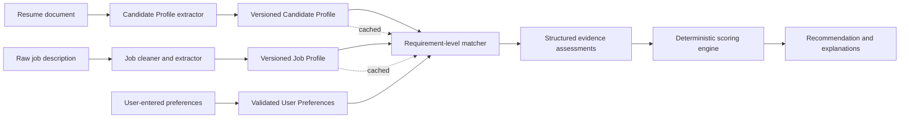

# Dali Job: Three-Step AI Matching Architecture

**Status:** Proposed
**Audience:** Product, engineering, data/ML, security, and QA
**Last updated:** August 15, 2026

## 1. Summary

Dali Job should replace a single large resume-plus-job matching prompt with a three-step pipeline:

1. **Resume → normalized Candidate Profile**
2. **Raw job description → cleaned and normalized Job Profile**
3. **Candidate Profile + Job Profile + separate User Preferences → requirement-level match assessment**

The first two steps extract reusable, evidence-linked facts. The third step compares those facts at the individual requirement level. The language model assesses whether candidate evidence satisfies each requirement, but application code calculates qualification and preference scores from controlled statuses and weights. This separation improves consistency, auditability, caching, cost, and the quality of user-facing explanations.

The system produces three distinct outcomes:

- **Qualification score:** How well the candidate's demonstrated evidence satisfies the employer's requirements.
- **Preference score:** How well the job satisfies the user's stated preferences.
- **Overall recommendation:** A product-level recommendation derived from both scores, hard constraints, confidence, and explicit policy.

Candidate aspirations, generated summaries, headlines, and target roles may provide context, but they must not count as qualification evidence. Missing information must remain unknown rather than being inferred as negative or fabricated as positive.

## 2. Problem Statement

Resume text and scraped job descriptions are both noisy. Resumes mix facts, marketing language, and aspirations. Job descriptions often contain duplicated sections, boilerplate, vague requirements, and inconsistent wording. Asking one model call to clean both documents, infer structure, compare them, score the match, and explain the result creates several problems:

- The same resume or job is repeatedly interpreted, increasing cost and latency.
- Generated summaries and target roles can accidentally be treated as evidence.
- Scores are difficult to reproduce or explain.
- Job boilerplate and duplicate requirements can distort scoring.
- Qualification and user preference are conflated into one opaque number.
- Prompt changes can unpredictably change extraction and scoring at the same time.
- There is no reliable requirement-level audit trail.

The proposed pipeline turns matching into a comparison of normalized, versioned artifacts with explicit evidence and deterministic score computation.

## 3. Goals

- Normalize resumes into reusable Candidate Profiles with traceable evidence.
- Clean and normalize raw job descriptions into reusable Job Profiles.
- Keep user preferences separate from qualifications and employer requirements.
- Assess every material job requirement against explicit candidate evidence.
- Use controlled match statuses and calibrated confidence rather than free-form judgments.
- Compute scores deterministically from structured model assessments.
- Produce concise, useful explanations, gaps, strengths, and follow-up questions.
- Make results reproducible, inspectable, cacheable, and versioned.
- Support incremental improvement of extraction, prompts, scoring, and models.
- Minimize unnecessary exposure of personally identifiable information (PII).

## 4. Non-Goals

- Proving that a candidate actually possesses a skill; the system evaluates submitted evidence only.
- Making autonomous hiring or rejection decisions.
- Inferring protected characteristics or using them in scoring.
- Predicting culture fit, personality, or future job performance.
- Rewriting resumes or job descriptions as part of the matching pipeline.
- Guaranteeing that every employer phrase has a single objectively correct interpretation.
- Replacing recruiter or candidate judgment.
- Using a model-generated target role, headline, or summary as proof of qualification.

## 5. Design Principles

### 5.1 Evidence over interpretation

Qualification claims must trace to primary resume evidence such as employment, projects, education, certifications, publications, or explicitly listed skills. Derived summaries are navigation aids, not evidence.

### 5.2 Unknown is not false

If the resume does not mention work authorization, location flexibility, years of experience, or a specific skill, record it as unknown. Do not silently convert absence into failure unless the product policy explicitly defines a missing response to a required hard constraint as unresolved.

### 5.3 Separate the three perspectives

- **Candidate Profile:** What the candidate has demonstrated.
- **Job Profile:** What the employer requests or offers.
- **User Preferences:** What the candidate wants.

The distinction allows a user to be highly qualified for an undesirable job, or moderately qualified for a highly desirable job.

### 5.4 Models classify; code scores

The model should identify requirements, retrieve evidence, assign controlled statuses, and explain its assessment. Stable application code should apply weights, caps, penalties, and rounding. This makes score changes intentional and testable.

### 5.5 Preserve provenance

Every extracted fact and every match should retain references to its source. The product should be able to answer: “Why did Dali Job say this?”

### 5.6 Version everything that affects results

Persist schema version, prompt version, model identifier, extraction policy version, and scoring policy version with each artifact and result.

## 6. High-Level Architecture and Data Flow



### Processing sequence

1. Ingest the resume, extract text, and assign stable source-span identifiers.
2. Generate and validate a Candidate Profile. Store it by resume content hash and extractor version.
3. Ingest the raw job description, remove exact duplication and presentation noise, then generate and validate a Job Profile. Store it by normalized job content hash and extractor version.
4. Validate user preferences independently. Do not merge them into the Candidate Profile.
5. Match each Job Profile requirement to Candidate Profile evidence.
6. Validate the structured assessment and reject unsupported evidence references.
7. Calculate qualification, preference, and overall results in deterministic code.
8. Generate explanations from the already structured assessments, preferably with templates for core facts and an optional model pass for fluent wording.

## 7. Canonical Data Model

The examples below are illustrative. Production schemas should use JSON Schema or equivalent typed models, reject unknown enum values, and distinguish omitted, `null`, and empty values.

### 7.1 Shared evidence reference

```json
{
  "source_id": "resume_01",
  "span_id": "exp_mighty_coders_01",
  "section": "experience",
  "quote": "Delivered one-on-one lessons in coding ... using Scratch, Java, Python, and Lua.",
  "start_char": 1842,
  "end_char": 1945
}
```

`quote` is optional in long-lived storage if offsets and immutable source content are retained. The API may return a short excerpt for display. Offsets must refer to the exact stored source version.

### 7.2 Candidate Profile schema

```json
{
  "schema_version": "candidate-profile.v1",
  "candidate_profile_id": "cp_123",
  "source": {
    "resume_id": "resume_01",
    "content_hash": "sha256:...",
    "language": "en"
  },
  "identity": {
    "name": "REDACTED_FOR_MATCHING",
    "current_location": null
  },
  "headline": {
    "value": "Computer Engineering Student and Coding Mentor",
    "kind": "derived",
    "evidence_refs": []
  },
  "summary": {
    "value": "Computer engineering undergraduate with teaching and project experience.",
    "kind": "derived",
    "evidence_refs": []
  },
  "skills": [
    {
      "canonical_name": "Python",
      "aliases_observed": ["Python"],
      "evidence_strength": "demonstrated",
      "last_used": null,
      "months_experience": null,
      "evidence_refs": [
        {"source_id": "resume_01", "span_id": "project_genomics_01"},
        {"source_id": "resume_01", "span_id": "exp_mighty_coders_01"}
      ]
    }
  ],
  "experience": [
    {
      "experience_id": "exp_01",
      "organization": "Mighty Coders",
      "title": "Code Mentor",
      "employment_type": null,
      "start_date": "2021-07",
      "end_date": null,
      "is_current": true,
      "responsibilities": [
        {
          "text": "Delivered individual coding lessons to children ages 7–14.",
          "skills": ["Scratch", "Java", "Python", "Lua", "Teaching"],
          "evidence_refs": [
            {"source_id": "resume_01", "span_id": "exp_mighty_coders_01"}
          ]
        }
      ]
    }
  ],
  "projects": [
    {
      "project_id": "proj_01",
      "name": "Serious Games with AI",
      "description": "Developed a 2D autonomous-ambulance simulation using pathfinding and AI decision-making.",
      "skills": ["Pathfinding Algorithms", "Artificial Intelligence"],
      "context": "academic",
      "evidence_refs": [
        {"source_id": "resume_01", "span_id": "project_beaverworks_01"}
      ]
    }
  ],
  "education": [
    {
      "institution": "University of Illinois Urbana-Champaign",
      "degree": "Bachelor of Science",
      "field": "Computer Engineering",
      "status": "in_progress",
      "expected_completion": "2026-05",
      "gpa": {"value": 3.9, "scale": 4.0},
      "evidence_refs": [
        {"source_id": "resume_01", "span_id": "education_uiuc_01"}
      ]
    }
  ],
  "certifications": [],
  "languages": [],
  "work_authorization": {
    "value": "unknown",
    "evidence_refs": []
  },
  "derived": {
    "estimated_seniority": "student_or_entry_level",
    "target_roles": ["Software Engineering Intern"],
    "industries": []
  },
  "quality": {
    "warnings": ["Minor in Mathematics appears intended but incomplete."],
    "completeness": 0.78
  },
  "generation": {
    "model": "model-id",
    "prompt_version": "candidate-extract.v1",
    "created_at": "2026-08-15T23:00:00Z"
  }
}
```

Notes:

- `kind: derived` fields cannot satisfy job requirements.
- Skill duration must remain `null` unless dates and relevant use support a defensible calculation.
- A skill listed only in a skills section can be classified as `claimed`; project or experience use may be `demonstrated`.
- Dates should use ISO 8601 with the precision available in the source.
- Preserve contradictory evidence and emit a warning rather than choosing silently.

### 7.3 Job Profile schema

```json
{
  "schema_version": "job-profile.v1",
  "job_profile_id": "jp_456",
  "source": {
    "job_id": "job_01",
    "content_hash": "sha256:...",
    "source_url": "https://example.com/jobs/123",
    "language": "en"
  },
  "title": "Software Engineer",
  "company": "Example Financial",
  "location": {
    "display": "Lansing, MI",
    "country": "US",
    "region": "MI",
    "city": "Lansing",
    "workplace_type": "onsite",
    "remote_regions": []
  },
  "employment_type": "full_time",
  "seniority": "entry_to_mid",
  "compensation": {
    "currency": "USD",
    "period": "year",
    "minimum": 80000,
    "maximum": 120000,
    "is_employer_provided": true
  },
  "requirements": [
    {
      "requirement_id": "req_01",
      "category": "experience",
      "statement": "Experience building and shipping real software",
      "importance": "required",
      "weight": 3,
      "hard_constraint": false,
      "acceptable_evidence_contexts": ["professional", "academic", "personal", "open_source"],
      "skills": ["Software Development"],
      "minimum_years": null,
      "source_refs": [
        {"source_id": "job_01", "span_id": "qualifications_01"}
      ]
    },
    {
      "requirement_id": "req_02",
      "category": "skill",
      "statement": "Proficiency with TypeScript, JavaScript, or a comparable language",
      "importance": "required",
      "weight": 3,
      "hard_constraint": false,
      "acceptable_alternatives": [
        ["TypeScript"],
        ["JavaScript"],
        ["Java"],
        ["C#"]
      ],
      "source_refs": [
        {"source_id": "job_01", "span_id": "qualifications_02"}
      ]
    }
  ],
  "responsibilities": [
    {
      "statement": "Build and maintain customer-facing software.",
      "source_refs": [
        {"source_id": "job_01", "span_id": "responsibilities_01"}
      ]
    }
  ],
  "benefits": [],
  "application_constraints": {
    "work_authorization": "unknown",
    "sponsorship_available": "unknown",
    "travel_percent": null,
    "clearance": null
  },
  "cleanup": {
    "duplicate_spans_removed": 2,
    "boilerplate_spans_ignored": 3,
    "warnings": ["Seniority wording is inconsistent across the description."]
  },
  "generation": {
    "model": "model-id",
    "prompt_version": "job-extract.v1",
    "created_at": "2026-08-15T23:01:00Z"
  }
}
```

The job extractor should identify atomic requirements. “Five years of Python and AWS experience” should normally become separate requirements unless the text clearly treats the combination as indivisible. Duplicate or paraphrased requirements should be merged while retaining all source references.

### 7.4 User Preferences schema

```json
{
  "schema_version": "user-preferences.v1",
  "user_id": "user_789",
  "revision": 12,
  "desired_roles": [
    {"value": "Software Engineer", "importance": "high"}
  ],
  "locations": {
    "allowed": ["Chicago, IL", "Remote-US"],
    "relocation": "maybe",
    "maximum_commute_minutes": 45,
    "importance": "high"
  },
  "workplace_types": [
    {"value": "remote", "preference": "strongly_prefer"},
    {"value": "hybrid", "preference": "accept"},
    {"value": "onsite", "preference": "avoid"}
  ],
  "compensation": {
    "minimum_base": 90000,
    "target_base": 110000,
    "currency": "USD",
    "period": "year",
    "importance": "high"
  },
  "employment_types": ["full_time"],
  "desired_skills": ["Python", "Machine Learning"],
  "avoided_industries": [],
  "hard_constraints": [
    {
      "field": "employment_type",
      "operator": "in",
      "value": ["full_time"]
    }
  ],
  "updated_at": "2026-08-15T22:00:00Z"
}
```

Preferences should be user-entered or explicitly confirmed. Resume-derived target roles can be suggested to the user but must not silently become preferences.

### 7.5 Match Assessment schema

```json
{
  "schema_version": "match-assessment.v1",
  "match_id": "match_abc",
  "candidate_profile_id": "cp_123",
  "job_profile_id": "jp_456",
  "preference_revision": 12,
  "requirement_assessments": [
    {
      "requirement_id": "req_01",
      "status": "partially_met",
      "confidence": 0.84,
      "evidence_refs": [
        {"source_id": "resume_01", "span_id": "project_beaverworks_01"}
      ],
      "reason": "The candidate built a working academic software project, but the resume does not establish production deployment or external users.",
      "missing": ["Evidence of production deployment or shipped software"]
    },
    {
      "requirement_id": "req_02",
      "status": "met_by_alternative",
      "confidence": 0.91,
      "evidence_refs": [
        {"source_id": "resume_01", "span_id": "exp_mighty_coders_01"}
      ],
      "reason": "The job explicitly accepts comparable languages; the candidate demonstrates Java experience.",
      "missing": []
    }
  ],
  "preference_assessments": [
    {
      "preference_key": "compensation.minimum_base",
      "status": "met",
      "confidence": 1.0,
      "reason": "The published salary range includes and exceeds the user's minimum."
    },
    {
      "preference_key": "workplace_types",
      "status": "conflict",
      "confidence": 0.98,
      "reason": "The job is onsite and the user marked onsite roles as avoid."
    }
  ],
  "hard_constraint_results": [],
  "scores": {
    "qualification": 68,
    "preference": 61,
    "overall": 65,
    "qualification_coverage": 0.93,
    "preference_coverage": 0.82,
    "policy_version": "score.v1"
  },
  "recommendation": {
    "label": "consider",
    "summary": "Promising entry-level fit with relevant programming evidence, but workplace preference is a meaningful drawback.",
    "strengths": ["Relevant Java and Python use", "Strong academic performance"],
    "gaps": ["No clear production deployment evidence"],
    "questions": ["Would academic or personal shipped projects satisfy the employer's experience expectation?"]
  },
  "generation": {
    "model": "model-id",
    "prompt_version": "requirement-match.v1",
    "created_at": "2026-08-15T23:02:00Z"
  }
}
```

## 8. Prompt Responsibilities and Guardrails

All model calls should use strict structured output, low-variance settings where supported, explicit schemas, and bounded source text. Each prompt has a narrow responsibility.

### 8.1 Candidate Profile extraction prompt

Responsibilities:

- Extract explicit facts and normalize terminology.
- Attach one or more valid resume evidence references to factual claims.
- Separate claimed skills from demonstrated skills.
- Label summaries, seniority estimates, target roles, and inferred industries as derived.
- Preserve uncertainty, incomplete dates, and contradictions.
- Avoid calculating experience duration across unrelated or overlapping activities.

Guardrails:

- Do not infer protected characteristics, age, ethnicity, religion, disability, family status, sexual orientation, or other sensitive traits.
- Do not infer citizenship or work authorization from name, school, address, or language.
- Do not upgrade “exposure to” into proficiency.
- Do not treat intended or incomplete education as completed.
- Do not invent metrics, dates, employers, titles, or technologies.
- Every non-derived qualification fact must cite a valid source span.

### 8.2 Job Profile cleanup and extraction prompt

Responsibilities:

- Ignore navigation, equal-opportunity language, generic company marketing, and unrelated boilerplate for matching purposes while retaining the raw source.
- Identify and merge duplicated or paraphrased requirements.
- Split compound requirements into atomic units where appropriate.
- Distinguish required, preferred, and informational statements.
- Extract hard constraints only when the job explicitly states them.
- Record alternatives, minimums, acceptable contexts, and ambiguity.

Guardrails:

- Do not convert responsibilities into mandatory qualifications without explicit wording or a documented extraction policy.
- Do not assume every technology named in the description is required.
- Do not invent a salary, workplace type, visa policy, degree requirement, or experience minimum.
- Preserve employer wording in `statement`; place normalization in structured fields.
- Do not let repeated text increase a requirement's weight.

### 8.3 Requirement-level matching prompt

Responsibilities:

- Evaluate one atomic job requirement at a time against permitted candidate evidence.
- Return one controlled status, confidence, evidence references, a concise reason, and missing evidence.
- Recognize explicit alternatives and transferable evidence when the job permits them.
- Identify unresolved hard constraints separately.
- Assess job-to-user preferences without using preferences as candidate qualifications.

Guardrails:

- Candidate headline, summary, desired roles, and preferences cannot satisfy employer requirements.
- Only cited Candidate Profile evidence may support `met`, `met_by_alternative`, or `partially_met`.
- Do not infer proficiency solely from a keyword.
- Do not translate missing evidence into a definitive lack of ability.
- Do not penalize a candidate for requirements absent from the Job Profile.
- Do not use prestige proxies such as school or employer reputation unless the job explicitly requires a relevant credential and policy permits it.
- Do not consider protected or sensitive traits, even if present in the source.
- A lower-confidence assessment should not be phrased as a certain fact.

### 8.4 Explanation generation

Core explanations should be generated from structured assessment fields, not by rereading raw documents. Templates should produce facts such as score, satisfied requirements, gaps, hard conflicts, and unknowns. An optional language-model pass may improve fluency but must not add claims or change scores/statuses.

## 9. Controlled Match Statuses

Use a small closed vocabulary for qualification assessments:

| Status | Meaning | Default score value |
|---|---|---:|
| `met` | Direct, relevant evidence satisfies the requirement. | 1.00 |
| `met_by_alternative` | Evidence satisfies an alternative explicitly allowed by the job or approved taxonomy. | 0.90 |
| `partially_met` | Some material components are supported, but a meaningful portion is missing. | 0.50 |
| `not_demonstrated` | No relevant evidence appears in the Candidate Profile. This is not proof the candidate lacks the capability. | 0.00 |
| `not_met` | Available evidence directly contradicts a measurable requirement. | 0.00 |
| `not_applicable` | The extracted item should not affect this match. | Excluded |
| `needs_clarification` | Ambiguity prevents a reliable assessment. | Excluded or policy-defined |

Use a separate vocabulary for preference assessment:

| Status | Meaning | Default score value |
|---|---|---:|
| `met` | Job meets the preference. | 1.00 |
| `partially_met` | Job partly meets it or falls within a tolerable range. | 0.50 |
| `conflict` | Job conflicts with the stated preference. | 0.00 |
| `unknown` | Job data is insufficient. | Excluded from score; lowers coverage |
| `not_applicable` | Preference does not apply. | Excluded |

Status definitions, examples, and edge cases should live in a versioned matching policy shared by prompts, validators, tests, and analytics.

## 10. Scoring Approach

### 10.1 Qualification score

For assessable requirements, compute:

```text
qualification_score = 100 × Σ(weight_i × value(status_i)) / Σ(weight_i)
```

Recommended initial weights:

- Required hard constraint: evaluated separately as a gate; also weight 5 for diagnostic scoring.
- Required qualification: 3.
- Preferred qualification: 1.
- Informational or responsibility-only item: 0 unless explicitly converted into a requirement.

The Job Profile may propose weights, but deterministic policy must validate or override them. Do not allow the model to emit arbitrary continuous weights.

Confidence should not directly multiply scores in the MVP because it can make results harder to explain and models may be poorly calibrated. Instead:

- Display or store average confidence.
- Route low-confidence assessments to `needs_clarification` or review.
- Use confidence calibration research before incorporating it into scoring.

### 10.2 Coverage

Scores without coverage can be misleading. Report:

```text
qualification_coverage = assessable requirement weight / total relevant requirement weight
preference_coverage = assessable preference weight / total applicable preference weight
```

If coverage is below a policy threshold, show a provisional result such as “insufficient information” instead of a precise recommendation.

### 10.3 Hard constraints

Examples include an explicitly mandatory license, clearance, location, work authorization, or employment type. Each should resolve to:

- `satisfied`
- `violated`
- `unknown`
- `not_applicable`

A verified violation caps the overall recommendation regardless of the numerical qualification score. An unknown hard constraint should trigger a question, not an automatic rejection. Policy should distinguish employer hard constraints from user hard constraints.

### 10.4 Preference score

Assign each user preference a product-defined importance weight, for example low = 1, medium = 2, high = 3. Then calculate the weighted average of known applicable assessments.

For continuous preferences, use deterministic functions. Example for base compensation:

- Job maximum below user's minimum: `conflict`.
- Job range includes minimum but not target: `partially_met`.
- Job range includes or exceeds target: `met`.
- No employer-provided range: `unknown`.

Location distance, commute, and compensation conversion should be computed by code or trusted services, not guessed by the language model.

### 10.5 Overall score and recommendation

An initial policy could be:

```text
overall_score = round(0.70 × qualification_score + 0.30 × preference_score)
```

Apply gates after calculation:

- Verified employer hard-constraint violation: recommendation cannot exceed `unlikely_fit`.
- Verified user hard-constraint violation: recommendation becomes `does_not_match_preferences` even if qualifications are strong.
- Low coverage: recommendation becomes `needs_more_information`.

Recommended labels:

- `strong_match`
- `good_match`
- `consider`
- `stretch`
- `unlikely_fit`
- `does_not_match_preferences`
- `needs_more_information`

Thresholds are product policy, not model output. They should be calibrated against human judgments and user outcomes. Keep both underlying scores visible so that the overall label never hides the reason.

### 10.6 Avoid false precision

Integer scores are convenient for sorting, but the UI should emphasize categories, evidence, and coverage. A score of 74 is not scientifically distinguishable from 75. Do not present more than one decimal place internally or whole-number precision externally unless evaluation demonstrates a benefit.

## 11. API and Component Boundaries

### 11.1 Resume ingestion service

```http
POST /v1/resumes
POST /v1/resumes/{resume_id}/candidate-profile
GET  /v1/candidate-profiles/{candidate_profile_id}
```

Responsibilities: document storage, text extraction, source spans, content hashes, PII handling, extraction orchestration, and profile validation.

### 11.2 Job ingestion service

```http
POST /v1/jobs
POST /v1/jobs/{job_id}/job-profile
GET  /v1/job-profiles/{job_profile_id}
```

Responsibilities: raw capture, deduplication, source spans, content hashes, structured extraction, and profile validation.

### 11.3 Preference service

```http
GET /v1/users/{user_id}/preferences
PUT /v1/users/{user_id}/preferences
```

Responsibilities: validation, revision history, explicit user consent, and hard-versus-soft preference semantics.

### 11.4 Matching service

```http
POST /v1/matches
GET  /v1/matches/{match_id}
```

Example request:

```json
{
  "candidate_profile_id": "cp_123",
  "job_profile_id": "jp_456",
  "preference_revision": 12,
  "matching_policy_version": "match-policy.v1",
  "scoring_policy_version": "score.v1"
}
```

The response may initially return `202 Accepted` with a job identifier. Matching should be idempotent for the tuple of input artifact versions, preference revision, prompt/model policy, and scoring policy.

### 11.5 Scoring engine

The scoring engine is a pure, deterministic library or service. It accepts validated assessments and policy versions, produces scores and gates, and has no model dependency. It should be unit-testable with fixtures.

### 11.6 Explanation renderer

The renderer accepts only validated profiles, assessments, and scores. It must never override a status or score. Template output is the default; optional model-written prose is treated as a presentation layer.

## 12. Validation and Trust Boundaries

Model output is untrusted input. Before persistence or scoring:

- Validate against an exact schema.
- Reject unknown enum values and malformed identifiers.
- Confirm every evidence reference exists in the correct source version.
- Confirm cited spans contain or support the asserted evidence.
- Confirm every job requirement is assessed exactly once.
- Confirm derived Candidate Profile fields are never cited as qualification evidence.
- Enforce bounded field lengths and array sizes.
- Remove prompt-injection-like instructions found inside resumes or job descriptions from the instruction hierarchy; documents are data only.
- Record validation errors without storing unnecessary raw sensitive content in logs.

Where possible, the matcher should receive structured profiles rather than raw resume and job text. If it needs a source excerpt, supply only the referenced excerpt through a clearly delimited data field.

## 13. Caching, Latency, and Cost

Candidate Profiles and Job Profiles are reusable assets and should be extracted once per content/version combination.

Recommended cache keys:

```text
candidate_profile:
  resume_content_hash + extraction_schema_version + prompt_version + model_id

job_profile:
  normalized_job_content_hash + extraction_schema_version + prompt_version + model_id

match_assessment:
  candidate_profile_id + job_profile_id + preference_revision
  + matching_policy_version + prompt_version + model_id

score:
  match_assessment_id + scoring_policy_version
```

Cost controls:

- Use deterministic preprocessing for exact duplicate removal before the job model call.
- Extract resumes only when their content changes.
- Reuse a Job Profile across candidates.
- Re-score without a model call when only the deterministic scoring policy changes.
- Recompute preference scoring without re-running qualification matching when only preferences change.
- Batch or parallelize independent requirement assessments when latency and model limits permit.
- Use a smaller validated model for extraction or easy comparisons, escalating ambiguous cases to a stronger model.
- Limit explanation generation to one short pass or template it entirely.
- Track tokens and cost per pipeline stage and per successful match.

Cache entries must not outlive privacy retention policies. Deleting a resume or account must invalidate or delete dependent artifacts as required.

## 14. Error Handling and Degraded Modes

### Resume ingestion errors

- Unsupported or corrupt document: ask for another file or pasted text.
- Poor OCR or sparse extraction: retain the raw artifact, report low quality, and request confirmation.
- Schema validation failure: retry once with validation feedback; then route to fallback/manual review.
- Conflicting facts: retain both with a warning.

### Job ingestion errors

- Empty, expired, or login-gated posting: mark unavailable and allow pasted text.
- Excessive duplication: run deterministic deduplication and report cleanup metrics.
- Ambiguous required/preferred language: mark ambiguity and lower confidence rather than guessing.
- Missing salary/location/workplace type: preserve `unknown`.

### Matching errors

- Stale or missing profile version: regenerate or return a version conflict.
- Model timeout/rate limit: retry with exponential backoff and idempotency keys.
- Partial requirement completion: do not publish a full score; either resume the job or label it incomplete.
- Invalid evidence citation: reject that assessment and retry only the affected requirement.
- Scoring failure: retain validated assessments and retry deterministic scoring.

### User-visible degraded behavior

- Distinguish “does not match” from “not enough information.”
- Show when salary, work authorization, location, or other important fields are unknown.
- Never display a confident overall recommendation when coverage is below threshold.
- Keep the prior successful result available when a refresh fails, clearly labeled with its timestamp and version.

## 15. Observability

Capture structured events for each stage without logging raw resumes or sensitive profile fields by default.

Key operational metrics:

- Request count, success rate, latency percentiles, retries, and timeout rate by stage.
- Tokens and estimated cost by model, prompt version, and pipeline stage.
- Cache hit rate for Candidate Profiles, Job Profiles, and matches.
- Schema validation failure and evidence-reference rejection rates.
- Percentage of requirements assigned each status.
- Average confidence and low-confidence rate.
- Qualification and preference coverage distributions.
- Frequency of hard-constraint violations and unknowns.
- Extraction warning rates, duplicate removal counts, and missing-field rates.
- Score drift following prompt, model, taxonomy, or policy changes.

Each request should carry a correlation ID across ingestion, extraction, matching, scoring, and explanation. Persist enough metadata to reproduce a result without placing sensitive document content in general logs.

Alert on sudden distribution changes, such as a sharp rise in `met`, `not_met`, validation failures, or missing requirements after a model or prompt update.

## 16. Testing and Evaluation

### 16.1 Unit and schema tests

- JSON Schema validation for all artifacts.
- Deterministic normalization and deduplication fixtures.
- Exact scoring tests for every status, weight, gate, and rounding rule.
- Evidence-reference integrity tests.
- Date precision and overlapping experience tests.
- Hard-constraint behavior and low-coverage tests.

### 16.2 Golden-set evaluation

Build a versioned, consented, de-identified dataset containing varied resumes, jobs, preferences, and expert annotations. Include:

- Students, career changers, experienced candidates, and nontraditional backgrounds.
- Sparse and verbose resumes.
- Noisy, duplicated, contradictory, and multilingual job descriptions.
- Required versus preferred qualifications.
- Exact skills, acceptable alternatives, and truly unrelated skills.
- Missing information and explicit contradictions.
- Hard constraints and preference conflicts.

Measure extraction at the field and requirement level, not just whole-document similarity.

Suggested metrics:

- Requirement extraction precision, recall, and atomicity.
- Required/preferred classification accuracy.
- Evidence citation validity and support rate.
- Match-status agreement with expert raters, including weighted Cohen's kappa.
- Hard-constraint false-negative and false-positive rates.
- Score/recommendation rank correlation with expert judgments.
- Calibration of model confidence.
- Explanation factuality and usefulness ratings.
- Slice-level performance across resume format, career stage, geography, and other permitted non-sensitive operational dimensions.

### 16.3 Regression and change management

Before changing a model, prompt, taxonomy, schema, or scoring policy:

1. Replay the golden set.
2. Compare status confusion matrices and score distributions.
3. Review changed hard-constraint outcomes manually.
4. Run shadow traffic if available.
5. Version and gradually roll out the change.
6. Retain rollback capability.

### 16.4 Product outcome evaluation

Offline agreement is insufficient. With appropriate consent and safeguards, measure whether users find explanations useful, correct missing information, save or apply to suggested jobs, and report obvious mismatches. Do not treat application or hiring outcomes alone as ground truth; they reflect market and human biases outside the matching system.

## 17. Privacy, Security, and Responsible Use

- Collect and retain only fields needed for matching and user-facing features.
- Encrypt source documents and structured profiles in transit and at rest.
- Apply tenant isolation and least-privilege access.
- Redact names, contact details, addresses, photos, and other nonessential identifiers before matching where practical.
- Do not extract or score protected characteristics or sensitive proxies.
- Treat resume and job text as untrusted data that may contain prompt injection attempts.
- Never let document text change system instructions, tool permissions, schemas, or scoring policy.
- Avoid placing raw documents, excerpts, or PII in routine logs, traces, analytics, or model error messages.
- Define retention, deletion, export, and account-closure behavior for raw and derived artifacts.
- Ensure deletion cascades to cached profiles, assessments, embeddings, and backups according to policy.
- Record model-provider data-handling configuration and ensure it matches product commitments.
- Provide users a way to see, correct, and regenerate their Candidate Profile.
- Clearly state that the output is decision support, not a hiring decision or guarantee.
- Conduct bias and disparate-impact reviews appropriate to the jurisdictions and use cases in which the product operates.
- Prevent downstream employer-facing use unless separately designed, reviewed, consented to, and legally assessed.

## 18. Taxonomy and Normalization

A controlled skill and role taxonomy can improve matching, but it must remain subordinate to source evidence.

Recommended approach:

- Preserve the observed term and add a canonical term.
- Version synonym and equivalence mappings.
- Separate aliases (“JS” → “JavaScript”) from alternatives (“Java” as an allowed substitute for “TypeScript”).
- Require explicit policy or job wording for alternatives; do not let the model freely declare technologies equivalent.
- Retain taxonomy confidence and permit `unmapped` values.
- Review high-impact mapping changes against the golden set.

Embeddings may retrieve potentially relevant evidence, but an embedding similarity score must not by itself satisfy a requirement. The final assessment still needs cited evidence and a controlled status.

## 19. MVP Scope

### Phase 1: Structured foundations

- Candidate Profile v1 for education, experience, projects, skills, certifications, and source evidence.
- Job Profile v1 for metadata, atomic requirements, importance, explicit alternatives, and hard constraints.
- User Preferences v1 for role, location/workplace type, employment type, and compensation.
- Strict schemas, artifact versioning, content hashing, and storage.
- English-language resumes and US-based job postings initially.

### Phase 2: Requirement matching and deterministic scoring

- Closed status vocabularies.
- Requirement-by-requirement evidence assessment.
- Deterministic qualification, preference, coverage, and overall calculations.
- Basic hard-constraint gates.
- Template-driven explanation with strengths, gaps, unknowns, and questions.
- Cache and idempotency support.

### Phase 3: Quality and rollout

- Curated golden set and expert labeling guide.
- Offline evaluation dashboard and regression gates.
- Shadow comparison against the existing matcher.
- Internal review UI showing source evidence and extracted requirements.
- Gradual user rollout with feedback and correction controls.

Explicitly defer from MVP:

- Automated inference of soft skills from writing style.
- Culture-fit scoring.
- Complex international compensation normalization.
- Unreviewed equivalence between large numbers of skills.
- Learning score weights directly from hiring outcomes.
- Fully autonomous employer-facing ranking.

## 20. Recommended Next Steps

1. Approve the separation between Candidate Profile, Job Profile, and User Preferences.
2. Finalize v1 schemas and controlled vocabularies with example fixtures.
3. Define the evidence-span format during resume and job text ingestion.
4. Write labeling guidance for atomic requirements, importance, evidence strength, and match status.
5. Implement the deterministic scoring engine first and lock its v1 policy with unit tests.
6. Build extraction prompts and validators against 30–50 representative documents.
7. Create an initial expert-annotated matching set covering common and adversarial edge cases.
8. Implement the matching orchestrator, cache keys, version metadata, and correlation IDs.
9. Compare the new pipeline with the current single-call matcher in shadow mode.
10. Tune thresholds and weights based on expert agreement and user usefulness, not intuition alone.

## 21. Open Decisions

- Which requirement types should qualify as hard constraints in v1?
- Should `needs_clarification` be excluded from scoring or receive a conservative partial value?
- What minimum coverage is required before showing an overall recommendation?
- Which skill alternatives are allowed by explicit taxonomy policy?
- Should academic and personal work satisfy “professional experience” only when the job permits it?
- What retention period applies to raw resumes, raw job text, and derived match artifacts?
- Which explanation fields are visible to users versus internal reviewers?
- What human review process is required before model, prompt, or scoring-policy rollout?

## 22. Acceptance Criteria for the MVP

The MVP is ready for limited rollout when:

- Every qualification result traces to valid Candidate Profile evidence.
- Derived candidate fields cannot satisfy requirements at the schema, prompt, or validator layer.
- Duplicate job text cannot increase qualification weight.
- Qualification and preference scores are separate and reproducible.
- Re-running deterministic scoring on the same assessment produces identical results.
- Unknown information is visibly distinct from failure.
- Hard constraints produce predictable, tested gates.
- All artifacts include schema, prompt/model, and policy versions.
- Cache invalidation works when a resume, job, preference revision, prompt, model, or scoring policy changes.
- Golden-set regression tests meet agreed thresholds, with no unresolved severe hard-constraint regressions.
- Users can inspect the main evidence, gaps, preference conflicts, and unresolved questions behind a recommendation.

---

This architecture makes the language model responsible for the work it is best suited to—interpreting messy text and assessing contextual evidence—while keeping business rules, scoring, privacy controls, and reproducibility in conventional software.
