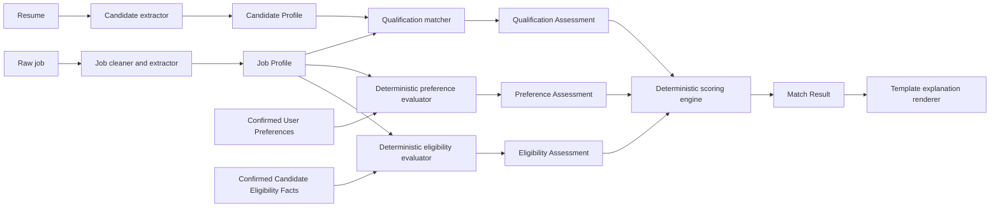

# DaliJob Three-Step Matching Architecture v2

**Status:** Proposed for implementation
**Supersedes:** `3-step_matching.md` after approval
**Audience:** Product, engineering, data/ML, security, and QA
**Last updated:** August 15, 2026

## 1. Decision summary

DaliJob will replace the current single prompt that interprets and scores a raw resume and job description at the same time.

The revised pipeline has three AI-assisted stages:

1. Resume text becomes a versioned Candidate Profile.
2. Raw job text becomes a versioned Job Profile.
3. One Candidate Profile and one Job Profile produce a requirement-level Qualification Assessment.

User preferences and user-confirmed eligibility facts follow separate deterministic paths. Application code compares structured job attributes with those artifacts, calculates all scores, applies hard-constraint gates, selects a recommendation, and renders the core explanation.

The model never owns a numerical score or final recommendation.

Every model call uses strict JSON Schema structured output. The schema sent to the model is a purpose-built response schema, not the complete persisted artifact schema. Application-owned identifiers, hashes, versions, timestamps, execution metadata, and user-confirmation state are attached only after model output passes structural and semantic validation.



## 2. Goals

- Produce stable, evidence-based qualification assessments.
- Remove duplicate job text and boilerplate before matching.
- Keep candidate qualifications, candidate aspirations, and user preferences separate.
- Make every displayed score reproducible in application code.
- Preserve evidence provenance without sending unnecessary PII to the matching model.
- Reuse extracted Candidate and Job Profiles across matching runs.
- Support an immediate account-free trial without an unbounded number of model calls.
- Support asynchronous scheduled matching using the same versioned artifacts.
- Allow prompt, model, taxonomy, and scoring changes to be evaluated and rolled back independently.

## 3. Non-goals

- Proving that a candidate possesses a skill beyond the evidence they submitted.
- Making an autonomous hiring or rejection decision.
- Predicting personality, culture fit, or future performance.
- Inferring or scoring protected characteristics.
- Treating a generated headline, summary, seniority estimate, or target role as evidence.
- Learning scoring weights directly from application or hiring outcomes in v1.
- Building international compensation normalization in v1.

## 4. Ownership and trust boundaries

Each artifact has one clear owner.

| Artifact | Owner | May contain scores? | May cite source evidence? |
|---|---|---:|---:|
| Candidate Profile | Candidate extraction model plus validator | No | Yes |
| Job Profile | Job extraction model plus validator | No | Yes |
| User Preferences | User and application validation | No | No |
| Candidate Eligibility Facts | User and application validation | No | No |
| Qualification Assessment | Qualification model plus validator | No | Yes |
| Preference Assessment | Deterministic application code | No | References structured fields |
| Eligibility Assessment | Deterministic application code | No | References structured fields |
| Match Result | Deterministic scoring engine | Yes | References assessments |
| Match Explanation | Template renderer | Displays existing scores only | References validated evidence |

All model output is untrusted input. Exact schema validation, identifier validation, source-reference validation, length limits, and artifact-version checks occur before persistence or scoring.

### 4.1 Model response schemas versus persisted artifacts

Each AI-assisted stage has two related but distinct contracts:

1. **Model response schema:** sent to the provider as strict JSON Schema. It contains only values the model is responsible for extracting or assessing.
2. **Persisted artifact schema:** constructed by application code from validated model output plus trusted application metadata.

All model response schemas use:

```json
{
  "strict": true,
  "schema": {
    "type": "object",
    "additionalProperties": false
  }
}
```

Production schemas must define every property, require every top-level field, bound string and collection sizes, and use closed enums. Optional semantic values are represented explicitly with `null` or empty collections rather than by allowing unrecognized fields.

The model must never generate or assert:

- Database or public artifact IDs.
- Source-content hashes.
- Schema, prompt, taxonomy, or scoring-policy versions.
- Creation or update timestamps.
- Model identifiers or provider execution references.
- `user_confirmed` state.
- Quota, entitlement, ownership, or tenant information.
- Numerical match scores or final recommendations.

Application code obtains provider model and execution identifiers from the provider response envelope, not from generated JSON.

### 4.2 Candidate extraction model response

The strict candidate-extraction response contains extracted evidence fields, career assessments, derived navigation fields, quality warnings, and a model recommendation for the default career profile.

```json
{
  "skills": [],
  "experience": [],
  "projects": [],
  "education": [],
  "certifications": [],
  "publications": [],
  "career_profiles": [
    {
      "local_ref": "career_software_engineering",
      "role_family": "software_engineering",
      "track": "individual_contributor",
      "level": "entry",
      "confidence": 0.86,
      "evidence_refs": ["resume_01:project:0003"],
      "dimension_signals": {
        "technical_depth": "developing",
        "production_delivery": "not_demonstrated",
        "scope_and_complexity": "limited",
        "system_design": "not_demonstrated",
        "ownership": "developing",
        "mentoring": "demonstrated",
        "cross_team_influence": "developing"
      }
    }
  ],
  "recommended_primary_career_profile_ref": "career_software_engineering",
  "derived": {
    "headline": "Computer Engineering Student and Coding Mentor",
    "summary": "Computer engineering undergraduate with teaching and project experience.",
    "suggested_target_roles": ["Software Engineer Intern"]
  },
  "quality": {
    "warnings": [],
    "completeness": 0.78
  }
}
```

`local_ref` is unique only inside one response and allows cross-reference validation. Application code assigns durable career-profile IDs after validation. The model recommends a primary profile but cannot claim that a user confirmed it.

### 4.3 Job extraction model response

The strict provider response contains normalized job facts, career context, atomic requirements, responsibilities, application constraints, and extraction warnings. It does not contain job IDs, URLs, hashes, versions, timestamps, provider metadata, or server policy decisions. The provider DTO requires `policy_alternative_group` and permits only `null`; the persisted domain model permits a server-assigned registered policy ID after validation.

```json
{
  "title": "Senior Software Engineer",
  "company": "Example Financial",
  "location": {
    "display": "Lansing, MI",
    "country": "US",
    "region": "MI",
    "city": "Lansing",
    "workplace_type": "onsite",
    "remote_regions": []
  },
  "employment_type": "full_time",
  "career_context": {
    "primary_role_family": "software_engineering",
    "adjacent_role_families": ["financial_technology"],
    "track": "individual_contributor",
    "target_level": "senior",
    "acceptable_level_range": {"minimum": "mid", "maximum": "staff"},
    "level_source": "explicit",
    "confidence": 0.98,
    "evidence_refs": ["job_01:title:0001"]
  },
  "compensation": {
    "currency": "USD",
    "period": "year",
    "minimum": 80000,
    "maximum": 120000,
    "is_employer_provided": true
  },
  "requirements": [
    {
      "local_ref": "req_shipping_software",
      "category": "experience",
      "scoring_dimension": "production_delivery",
      "statement": "Experience building and shipping real software",
      "importance": "required",
      "hard_constraint": false,
      "acceptable_evidence_contexts": ["professional", "academic", "personal", "open_source"],
      "minimum_years": null,
      "explicit_alternatives": [],
      "policy_alternative_group": null,
      "source_refs": ["job_01:requirements:0004"]
    }
  ],
  "responsibilities": [],
  "application_constraints": {
    "work_authorization": "unknown",
    "sponsorship_available": "unknown",
    "travel_percent": null,
    "clearance": null
  },
  "cleanup": {
    "duplicate_spans_removed": 0,
    "boilerplate_spans_ignored": 0,
    "warnings": []
  }
}
```

Requirement `local_ref` values are response-local. Cleanup counters are also server-owned and constrained to zero in the provider DTO. Application code validates uniqueness and source references, computes cleanup counters, deterministically maps normalized employer alternatives to registered policies, assigns durable requirement IDs, and rewrites approved local cross-references before persisting the Job Profile.

### 4.4 Qualification model response

The strict qualification response contains only assessments. Candidate, job, and selected-career-profile IDs come from the validated request context and are attached by application code.

```json
{
  "requirement_assessments": [
    {
      "requirement_id": "req_01",
      "status": "partially_met",
      "confidence": 0.84,
      "evidence_refs": ["resume_01:project:0003"],
      "alternative_policy_ref": null,
      "reason": "The project demonstrates implementation but not production deployment.",
      "missing": ["Evidence of production deployment"]
    }
  ],
  "hard_constraint_assessments": []
}
```

The request supplies the complete allowed requirement-ID and evidence-reference sets. After JSON Schema validation, semantic validation confirms that every normal requirement and hard constraint appears exactly once in its respective collection, no ID appears in both collections, all references are allowed, positive statuses cite evidence, and alternatives cite explicit job wording or an approved policy.

## 5. Canonical source and evidence spans

### 5.1 Canonical source text

Evidence offsets refer to immutable canonical source text, not to a later cleaned or model-generated representation.

Canonicalization v1 performs only these deterministic operations:

1. Decode extracted text as Unicode.
2. Normalize Unicode to NFC.
3. Convert `CRLF` and lone `CR` line endings to `LF`.
4. Remove NUL characters.
5. Preserve all other characters and whitespace.

The canonical source record stores:

- SHA-256 of canonical UTF-8 bytes.
- Text-extraction implementation and version.
- OCR implementation and version when applicable.
- Canonicalization policy version.
- Original document identifier and revision.

### 5.2 Span contract

A deterministic span builder assigns spans before any model call. A span is normally a heading, bullet, paragraph, table row, or bounded fallback block.

```json
{
  "source_id": "resume_01",
  "source_hash": "sha256:...",
  "span_id": "resume_01:experience:0007",
  "section": "experience",
  "start_utf8_byte": 1842,
  "end_utf8_byte": 1945,
  "excerpt": "Delivered one-on-one lessons in coding using Java and Python."
}
```

Offsets are zero-based, half-open UTF-8 byte offsets into the exact canonical source version. The model selects existing `span_id` values; it cannot create span identifiers or offsets.

The validator confirms that every referenced span exists and belongs to the expected source. Semantic support is evaluated through golden-set testing and audit sampling; identifier validity alone is not treated as proof that a citation supports a claim.

## 6. Candidate Profile v1

The Candidate Profile contains extracted qualification evidence and separately labeled derived navigation fields.

```json
{
  "schema_version": "candidate-profile.v1",
  "candidate_profile_id": "cp_123",
  "source": {
    "resume_id": "resume_01",
    "source_hash": "sha256:...",
    "text_extraction_version": "resume-text.v1",
    "canonicalization_version": "canonical-text.v1",
    "language": "en"
  },
  "skills": [
    {
      "observed_name": "Python",
      "canonical_name": "Python",
      "evidence_strength": "demonstrated",
      "last_used": null,
      "months_experience": null,
      "evidence_refs": ["resume_01:project:0003", "resume_01:experience:0007"]
    }
  ],
  "experience": [
    {
      "experience_id": "exp_01",
      "organization": "Mighty Coders",
      "title": "Code Mentor",
      "start_date": "2021-07",
      "end_date": null,
      "is_current": true,
      "context": "professional",
      "evidence_refs": ["resume_01:experience:0007"]
    }
  ],
  "projects": [],
  "education": [],
  "certifications": [],
  "publications": [],
  "career_profiles": [
    {
      "career_profile_id": "career_software_engineering",
      "role_family": "software_engineering",
      "track": "individual_contributor",
      "level": "entry",
      "confidence": 0.86,
      "evidence_refs": ["resume_01:project:0003", "resume_01:experience:0007"],
      "dimension_signals": {
        "technical_depth": "developing",
        "production_delivery": "not_demonstrated",
        "scope_and_complexity": "limited",
        "system_design": "not_demonstrated",
        "ownership": "developing",
        "mentoring": "demonstrated",
        "cross_team_influence": "developing"
      }
    },
    {
      "career_profile_id": "career_technical_education",
      "role_family": "technical_education",
      "track": "individual_contributor",
      "level": "mid",
      "confidence": 0.81,
      "evidence_refs": ["resume_01:experience:0007"],
      "dimension_signals": {
        "technical_depth": "developing",
        "production_delivery": "not_applicable",
        "scope_and_complexity": "demonstrated",
        "system_design": "not_applicable",
        "ownership": "demonstrated",
        "mentoring": "demonstrated",
        "cross_team_influence": "developing"
      }
    }
  ],
  "recommended_primary_career_profile_id": "career_software_engineering",
  "derived": {
    "headline": "Computer Engineering Student and Coding Mentor",
    "summary": "Computer engineering undergraduate with teaching and project experience.",
    "suggested_target_roles": ["Software Engineer Intern"]
  },
  "quality": {
    "warnings": [],
    "completeness": 0.78
  },
  "generation": {
    "model": "model-id",
    "prompt_version": "candidate-extract.v1",
    "taxonomy_version": "skills.v1"
  }
}
```

Candidate extraction rules:

- Names, email addresses, phone numbers, street addresses, and photos are excluded from the matching artifact.
- A skill mentioned only in a skill list is `claimed`.
- Use in an experience or project may be `demonstrated`.
- A duration remains `null` unless dated evidence supports a defensible calculation.
- Incomplete education remains incomplete.
- Contradictions are preserved as warnings.
- Fields under `derived` can be shown or suggested but cannot satisfy a requirement.
- Resume-derived target roles require explicit user confirmation before becoming search preferences.
- A candidate may have multiple career profiles because level and track are role-family-specific rather than global.
- Career levels in v1 are `unknown`, `student_or_intern`, `entry`, `junior`, `mid`, `senior`, `staff`, and `principal`.
- Career tracks in v1 are `individual_contributor`, `architect`, `engineering_management`, `research`, `technical_program`, and `technical_education`.
- `architect` is a track, not a universal level above `principal`.
- Each career-profile assessment must cite evidence and expose the capability dimensions used to infer its level.
- The immutable Candidate Profile stores one recommended primary career-profile ID. A separate revisioned Candidate Career Selection stores the effective user or provisional selection.
- The model returns `recommended_primary_career_profile_ref`; application code resolves it to a durable ID before storing the recommendation. It cannot record `user_confirmed` state.
- Changing the primary selection does not change qualification evidence, inferred levels, or previously persisted match snapshots.

### 6.1 Candidate Career Selection v1

Primary selection is a mutable, revisioned overlay rather than part of the content-addressed Candidate Profile extraction artifact.

```json
{
  "schema_version": "candidate-career-selection.v1",
  "candidate_profile_id": "cp_123",
  "revision": 4,
  "primary_career_profile_id": "career_software_engineering",
  "selection_source": "user_confirmed",
  "updated_at": "2026-08-15T23:05:00Z"
}
```

`selection_source` is `model_default`, `user_confirmed`, or `operator_corrected`. Guests use `model_default`. Authenticated users may confirm or change the selection with optimistic revision checks. APIs may return a composed Candidate Profile view. Candidate extraction caching excludes this mutable overlay, while Qualification Assessment identity includes the explicit selection revision because the selection may be used as a deterministic fallback.

## 7. Job Profile v1

### 7.0 Current extraction contract: Job Profile v3

The examples later in this section preserve the original v1 architecture for historical
traceability. New Job Profile extraction uses the following versioned contract:

- `job-profile.v3`, `job-extract-response.v3`, and `job-extract.v3`;
- ordinary requirements use only `required` and `optional` importance;
- there is no model-owned `hard_constraint` on an ordinary requirement;
- work authorization, sponsorship, travel, and clearance remain single-owner eligibility facts
  under `application_constraints`;
- explicit employer alternatives are structured as cited `alternative_groups` with `any_of`
  members; `policy_alternative_group` is always null in model output and is assigned only by the
  deterministic registry;
- the job-only taxonomy adds machine-learning, hardware, embedded, and technical-program role
  families plus product/program tracks without changing Candidate Profile v1;
- compensation is excluded from model ownership pending a cited multi-range representation;
- section coverage, adjacent-family consistency, employment-type evidence, and constraint
  duplication are enforced before persistence, with one full-replacement repair attempt.

Qualification Assessment v2 consumes Job Profile v3 directly. The normalized database row retains
`hard_constraint=false` and a flattened alternative value only so historical v1 artifacts remain
readable; the v2 model input is reconstructed from the persisted Job Profile v3 artifact and uses
its structured alternative groups.

Exact duplicate removal runs before the job extraction model. The extractor receives bounded cleaned text plus valid source-span identifiers.

```json
{
  "schema_version": "job-profile.v1",
  "job_profile_id": "jp_456",
  "source": {
    "job_id": "job_01",
    "source_hash": "sha256:...",
    "source_url": "https://example.com/jobs/123",
    "text_extraction_version": "job-text.v1",
    "canonicalization_version": "canonical-text.v1",
    "deduplication_version": "job-dedup.v1",
    "language": "en"
  },
  "title": "Senior Software Engineer",
  "company": "Example Financial",
  "location": {
    "display": "Lansing, MI",
    "country": "US",
    "region": "MI",
    "city": "Lansing",
    "workplace_type": "onsite",
    "remote_regions": []
  },
  "employment_type": "full_time",
  "career_context": {
    "primary_role_family": "software_engineering",
    "adjacent_role_families": ["financial_technology"],
    "track": "individual_contributor",
    "target_level": "senior",
    "acceptable_level_range": {
      "minimum": "mid",
      "maximum": "staff"
    },
    "level_source": "explicit",
    "confidence": 0.98,
    "evidence_refs": ["job_01:title:0001", "job_01:requirements:0004"]
  },
  "compensation": {
    "currency": "USD",
    "period": "year",
    "minimum": 80000,
    "maximum": 120000,
    "is_employer_provided": true
  },
  "requirements": [
    {
      "requirement_id": "req_01",
      "category": "experience",
      "scoring_dimension": "production_delivery",
      "statement": "Experience building and shipping real software",
      "importance": "required",
      "hard_constraint": false,
      "acceptable_evidence_contexts": ["professional", "academic", "personal", "open_source"],
      "minimum_years": null,
      "source_refs": ["job_01:requirements:0004"]
    },
    {
      "requirement_id": "req_02",
      "category": "skill",
      "scoring_dimension": "technical_skill",
      "statement": "Experience in TypeScript, JavaScript, or a comparable language",
      "importance": "required",
      "hard_constraint": false,
      "explicit_alternatives": ["TypeScript", "JavaScript"],
      "policy_alternative_group": "general-purpose-programming-language.v2",
      "source_refs": ["job_01:requirements:0005"]
    },
    {
      "requirement_id": "req_03",
      "category": "skill",
      "scoring_dimension": "technical_skill",
      "statement": "Python experience",
      "importance": "preferred",
      "hard_constraint": false,
      "explicit_alternatives": ["Python"],
      "policy_alternative_group": null,
      "source_refs": ["job_01:preferences:0002"]
    }
  ],
  "responsibilities": [],
  "application_constraints": {
    "work_authorization": "unknown",
    "sponsorship_available": "unknown",
    "travel_percent": null,
    "clearance": null
  },
  "cleanup": {
    "duplicate_spans_removed": 2,
    "boilerplate_spans_ignored": 3,
    "warnings": []
  },
  "generation": {
    "model": "model-id",
    "prompt_version": "job-extract.v2",
    "taxonomy_version": "skills.v1"
  }
}
```

Job extraction rules:

- Split compound requirements when their components can be assessed independently.
- Merge duplicates while retaining every source reference.
- Do not turn a responsibility into a requirement without explicit employer language or a versioned policy.
- Do not treat every technology mentioned in prose as required.
- Extract only explicit hard constraints.
- Preserve missing salary, location, workplace type, and authorization information as unknown.
- The model emits `importance`, not a numerical weight.
- Every requirement has exactly one controlled `scoring_dimension`; code uses it to select the level- and track-aware multiplier.
- The model extracts employer-stated alternatives only into `explicit_alternatives` and always returns `policy_alternative_group: null`.
- After semantic validation, deterministic code may assign a policy only when normalized alternatives exactly satisfy a versioned registry rule. Model-suggested policy identifiers are never accepted.
- A job has one primary role family and track. Adjacent role families provide context but do not independently change scoring.
- `target_level` is the best-supported expected level; an acceptable range is included only when the posting supports one.
- `level_source` is `explicit`, `inferred_from_requirements`, or `unknown`. An inferred level must cite the responsibilities or requirements supporting it and carry confidence.
- A title alone may establish an explicit label, but requirement extraction must still preserve the actual experience, scope, architecture, and leadership expectations.

Job Profile validation and repair order:

1. Validate the provider response against the strict null-only structured-output schema.
2. Normalize model-owned fields and perform semantic validation.
3. For a recoverable failure, retry once with sanitized error codes and paths and require a complete replacement Job Profile.
4. Deterministically assign registered alternative policies from normalized `explicit_alternatives`.
5. Run final domain semantic validation and only then persist.

The public failure body contains `JOB_PROFILE_VALIDATION_FAILED`, stage, correlation ID, and whether repair was attempted. Raw output, source text, and detailed validation data remain available only in protected evaluation traces.

## 8. User Preferences v1

User Preferences contain only user-entered or explicitly confirmed choices. They are never qualification evidence and are not sent to the qualification model.

```json
{
  "schema_version": "user-preferences.v1",
  "user_id": "user_789",
  "revision": 12,
  "desired_roles": [
    {"value": "Software Engineer", "importance": "high"}
  ],
  "locations": {
    "allowed": ["Chicago, IL", "Remote-US"],
    "relocation": "maybe",
    "maximum_commute_minutes": 45,
    "importance": "high"
  },
  "workplace_types": [
    {"value": "remote", "preference": "strongly_prefer", "importance": "high"},
    {"value": "hybrid", "preference": "accept", "importance": "medium"},
    {"value": "onsite", "preference": "avoid", "importance": "high"}
  ],
  "compensation": {
    "minimum_base": 90000,
    "target_base": 110000,
    "currency": "USD",
    "period": "year",
    "importance": "high"
  },
  "employment_types": {
    "allowed": ["full_time"],
    "importance": "high"
  },
  "desired_skills": [
    {"value": "Python", "importance": "medium"},
    {"value": "Machine Learning", "importance": "high"}
  ],
  "avoided_industries": [
    {"value": "tobacco", "importance": "high"}
  ],
  "hard_constraints": [
    {"field": "employment_type", "operator": "in", "value": ["full_time"]}
  ],
  "updated_at": "2026-08-15T22:00:00Z"
}
```

The account-free trial initially has only target role and location. Missing optional preferences do not reduce the qualification score or create an artificial preference penalty.

### 8.1 Candidate Eligibility Facts v1

Candidate Eligibility Facts contain sensitive facts that only the user may confirm. They are versioned separately from the resume and preferences, are never inferred from a name, address, school, language, nationality, or resume text, and are never sent to the qualification model.

```json
{
  "schema_version": "candidate-eligibility-facts.v1",
  "user_id": "user_789",
  "revision": 3,
  "work_authorizations": [
    {
      "country": "US",
      "status": "authorized",
      "requires_sponsorship": false
    }
  ],
  "clearances": [],
  "licenses": [],
  "travel_availability_percent": null,
  "relocation": "maybe",
  "updated_at": "2026-08-15T22:00:00Z"
}
```

Controlled values are defined by `eligibility-policy.v1`. Work-authorization `status` is `authorized`, `not_authorized`, or `unknown`; sponsorship is boolean or unknown; and absence of an item means unknown, not false. Guest trials may omit this artifact. The API and storage layer treat it as private, access-controlled data and do not expose it in explanations beyond the minimum question or gate reason needed by the user.

### 8.2 Eligibility Assessment v1: application output

The deterministic eligibility evaluator compares one immutable Candidate Eligibility Facts revision with the Job Profile's structured `application_constraints`. Employer constraints represented here do not also appear in `hard_constraint_assessments`; evidence-based qualification requirements remain in Qualification Assessment, while application eligibility is evaluated only here.

```json
{
  "schema_version": "eligibility-assessment.v1",
  "job_profile_id": "jp_456",
  "eligibility_revision": 3,
  "items": [
    {
      "constraint_key": "work_authorization.US",
      "status": "satisfied",
      "reason_code": "USER_AUTHORIZED_NO_SPONSORSHIP_REQUIRED"
    },
    {
      "constraint_key": "travel_percent",
      "status": "unknown",
      "reason_code": "USER_TRAVEL_AVAILABILITY_UNKNOWN"
    }
  ],
  "policy_version": "eligibility-policy.v1"
}
```

Eligibility statuses are `satisfied`, `violated`, `unknown`, and `not_applicable`. The evaluator produces exactly one item for every material Job Profile application constraint. Missing user facts produce `unknown`; they never produce `violated`. A verified violation or unknown is passed to the gate engine under the employer hard-constraint rules in Section 11.5. If the job does not state a constraint, its status is `not_applicable` and the app does not ask the user for it.

## 9. Qualification Assessment v1: model output

### 9.0 Current matching contract: Qualification Assessment v2

The v1 example below remains for historical artifact compatibility. New Stage 3 matching uses
`qualification-assessment.v2`, `qualification-assessment-response.v2`,
`qualification-match.v2`, `qualification-policy.v2`, and `qualification-input.v2`.

The v2 model receives the non-derived, evidence-bearing Candidate Profile collections, their
canonical evidence spans, the selected career context, and Job Profile v3 requirements with
structured alternative groups. It returns one `requirement_assessments` collection; there is no
hard-constraint collection and no numerical score.

Each requirement is classified exactly once as:

- `met`: cited evidence covers the complete requirement;
- `met_by_alternative`: cited evidence covers an explicit employer alternative group member or
  an approved server policy, identified by an exact registered reference;
- `partially_met`: cited evidence covers a material portion and `missing` records the remaining gap;
- `not_demonstrated`: available evidence does not demonstrate the requirement, with no supporting
  evidence refs and with the needed evidence listed in `missing`.

Required and optional importance use the same evidence semantics. Importance is consumed later by
the deterministic score policy and cannot change a Stage 3 status. Career context guides
interpretation but cannot satisfy a requirement. The strict schema and semantic validator reject
missing or duplicate requirement decisions, invented evidence IDs, invented alternative refs,
unsupported positive statuses, partial decisions without gaps, and score/rank/recommendation fields.

Qualification v1 artifacts remain immutable and readable through the API union. New normalized
assessment rows use `collection_kind=normal`; `alternative_group_refs` are persisted separately from
the server policy reference.

The qualification model evaluates all atomic requirements for one job in one structured-output call. It does not receive User Preferences and cannot return scores.

The JSON shown below is the persisted Qualification Assessment envelope. The model returns only `requirement_assessments` and `hard_constraint_assessments`; application code attaches artifact IDs and trusted generation metadata.

```json
{
  "schema_version": "qualification-assessment.v1",
  "candidate_profile_id": "cp_123",
  "candidate_career_selection_revision": 4,
  "selected_career_profile_id": "career_software_engineering",
  "job_profile_id": "jp_456",
  "requirement_assessments": [
    {
      "requirement_id": "req_01",
      "status": "partially_met",
      "confidence": 0.84,
      "evidence_refs": ["resume_01:project:0003"],
      "reason": "The candidate built a working academic project, but the evidence does not establish production deployment.",
      "missing": ["Evidence of production deployment or external users"]
    },
    {
      "requirement_id": "req_02",
      "status": "met_by_alternative",
      "confidence": 0.91,
      "evidence_refs": ["resume_01:experience:0007"],
      "alternative_policy_ref": "general-purpose-programming-language.v1",
      "reason": "The approved policy permits demonstrated Java experience as an alternative.",
      "missing": []
    },
    {
      "requirement_id": "req_03",
      "status": "met",
      "confidence": 0.96,
      "evidence_refs": ["resume_01:project:0003", "resume_01:experience:0007"],
      "alternative_policy_ref": null,
      "reason": "The candidate demonstrates Python use in both project and teaching evidence.",
      "missing": []
    }
  ],
  "hard_constraint_assessments": [],
  "generation": {
    "model": "model-id",
    "prompt_version": "qualification-match.v1",
    "matching_policy_version": "qualification-policy.v1"
  }
}
```

Exactly one normal assessment must exist for every Job Profile requirement where `hard_constraint` is false. Exactly one hard-constraint assessment must exist for every requirement where `hard_constraint` is true. No requirement may appear in both collections. The model may use only cited, non-derived Candidate Profile evidence for a positive status.

The matcher selects the candidate career profile with the closest role-family and track relationship to the job. It does not automatically use the candidate's primary career profile. The selected career profile ID is persisted with the Qualification Assessment for auditability. Primary status is used for search defaults and tie-breaking only.

### 9.1 Qualification statuses

| Status | Meaning | Score value | Included in coverage numerator? |
|---|---|---:|---:|
| `met` | Direct evidence satisfies the requirement. | 1.00 | Yes |
| `met_by_alternative` | Evidence satisfies an explicit or policy-approved alternative. | 0.90 | Yes |
| `partially_met` | A material portion is supported and a material portion is missing. | 0.50 | Yes |
| `not_demonstrated` | No supporting evidence is present. This is not proof of inability. | 0.00 | Yes |
| `not_met` | Evidence directly contradicts a measurable requirement. | 0.00 | Yes |
| `needs_clarification` | The job requirement itself is ambiguous or candidate evidence conflicts. | Excluded | No |
| `not_applicable` | Validated policy says the extracted item should not affect matching. | Excluded | Excluded from denominator |

Absence of evidence for an ordinary requirement is always `not_demonstrated`, not `needs_clarification`. This prevents missing evidence from inflating the score by shrinking the denominator.

Confidence does not multiply the score in v1. A confidence below `0.60` is converted by validation to `needs_clarification` unless the status is `not_demonstrated`, which requires no inferred claim.

## 10. Preference Assessment v1: application output

Application code compares Job Profile values with the immutable User Preference revision.

```json
{
  "schema_version": "preference-assessment.v1",
  "job_profile_id": "jp_456",
  "preference_revision": 12,
  "items": [
    {
      "preference_key": "compensation.minimum_base",
      "importance": "high",
      "status": "met",
      "reason_code": "JOB_RANGE_MEETS_MINIMUM"
    },
    {
      "preference_key": "workplace_types",
      "importance": "high",
      "status": "conflict",
      "reason_code": "ONSITE_MARKED_AVOID"
    }
  ],
  "hard_constraint_results": [],
  "policy_version": "preference-policy.v1"
}
```

Preference statuses are `met = 1.0`, `partially_met = 0.5`, `conflict = 0.0`, `unknown = excluded`, and `not_applicable = excluded from the denominator`.

Importance weights are `low = 1`, `medium = 2`, and `high = 3`.

`preference-policy.v1` evaluates each configured category with the following deterministic rules:

- **Desired role:** an exact canonical role-family or title match is `met`; an approved adjacent role-family relationship is `partially_met`; a known unrelated role is `conflict`; and an unmapped job role is `unknown`. For multiple desired roles, the evaluator keeps the best status, then the highest importance, then the lexicographically smallest canonical role ID as the stable tie-breaker.
- **Location:** a remote job with an allowed remote region is `met`. An exact or contained canonical allowed region is `met`. A trusted commute at or below the maximum is `met`; a longer commute with relocation `yes` or `maybe` is `partially_met`; and a longer commute with relocation `no` is `conflict`. Missing or ambiguous locations and unavailable trusted geospatial results are `unknown`.
- **Workplace type:** a known job workplace type configured as `strongly_prefer` or `accept` is `met`; one configured as `avoid` is `conflict`; and an unknown job value or unconfigured type is `unknown`. The category produces one assessment and cannot gain weight from multiple list entries.
- **Compensation:** job maximum below the user's minimum is `conflict`; a range that meets the minimum but not the target is `partially_met`; and a range that includes or exceeds the target is `met`. Missing employer compensation is `unknown`. Currency or pay-period conversion requires the versioned deterministic conversion policy; unsupported conversions are `unknown`.
- **Employment type:** a known job type in `allowed` is `met`; a known type outside it is `conflict`; and a missing or unmapped type is `unknown`.
- **Desired skills:** each configured skill is assessed separately. An exact canonical skill found in validated requirements or responsibilities is `met`; an approved related-skill or alternative-policy relationship is `partially_met`; absence from a complete Job Profile is `conflict`; and absence from an incomplete or truncated relevant job section is `unknown`.
- **Avoided industries:** a known job industry in the avoided set is `conflict`; a known industry outside it is `met`; and a missing or unmapped industry is `unknown`. This category produces one assessment regardless of the number of avoided industries.

Every item records a stable reason code from the policy registry. Exactly one result is emitted for each applicable scalar/category preference key and one result per desired-skill item; duplicate canonical values are rejected when the preference revision is created. User `hard_constraints` are evaluated as gates and excluded from the preference numerator and denominator so the same choice cannot be counted twice. Role, skill, industry, geospatial, currency-conversion, and alternative-policy versions are explicit Preference Assessment inputs and cache-key components.

## 11. Deterministic scoring policy v1

### 11.1 Qualification weights

Weights are derived by code and never accepted from the model:

- Employer hard constraint: excluded from the numerical qualification score and evaluated separately as a gate.
- Required qualification: weight 3.
- Preferred qualification: weight 1.
- Informational or responsibility-only item: weight 0.

```text
qualification_score =
  100 × Σ(weight × status_value) / Σ(weight for relevant requirements)

qualification_coverage =
  Σ(weight for assessed requirements) / Σ(weight for relevant requirements)
```

`not_applicable` requirements are removed from both denominators. `needs_clarification` remains in the relevant-requirement denominator, contributes no numerator value, and is excluded from the coverage numerator. Other statuses count as assessed. Hard constraints are excluded from this formula and handled only by gate policy.

The public qualification result requires coverage of at least `0.80`. Below that threshold, the result is provisional and the public recommendation is `needs_more_information`.

### 11.2 Level- and track-aware requirement weights

The Job Profile's role family, track, and target level select a versioned scoring-policy table. Candidate level does not directly add points or impose a penalty; doing so would double-count the evidence used to infer it. The actual job requirements remain the units being assessed.

For each non-constraint requirement:

```text
requirement_weight = importance_weight × dimension_multiplier
```

`importance_weight` remains 3 for required and 1 for preferred. `dimension_multiplier` is selected by deterministic policy from the requirement's validated `scoring_dimension` and the job's track and target level. The extraction model cannot emit it.

Initial software individual-contributor multipliers are:

| Requirement dimension | Entry | Junior | Mid | Senior | Staff | Principal |
|---|---:|---:|---:|---:|---:|---:|
| `technical_skill` | 1.25 | 1.15 | 1.00 | 0.75 | 0.60 | 0.50 |
| `applied_experience` | 0.75 | 1.00 | 1.10 | 1.25 | 1.25 | 1.20 |
| `production_delivery` | 0.75 | 1.00 | 1.20 | 1.30 | 1.35 | 1.30 |
| `system_design_architecture` | 0.50 | 0.75 | 1.00 | 1.25 | 1.50 | 1.60 |
| `mentoring_leadership` | 0.25 | 0.50 | 0.75 | 1.20 | 1.40 | 1.50 |
| `organizational_influence` | 0.25 | 0.25 | 0.50 | 0.90 | 1.40 | 1.60 |

These are initial product-policy values, not claims about universal career ladders. They require golden-set calibration before customer rollout. Track-specific policies may provide different tables; for example, an `architect` track would emphasize system design and cross-team technical decisions, while a `research` track would emphasize research depth, experimental rigor, and publications. Such a table cannot be used publicly until it is registered and approved under Section 20.3.

Baseline technical requirements do not disappear for senior jobs. Their relative contribution decreases while demonstrated delivery, scope, architecture, and influence receive more weight. Explicit hard constraints continue to use gate policy rather than these multipliers.

Public scoring requires an approved `(role_family, track)` policy. An unknown, low-confidence, or unsupported track, or a role-family/track pair with no approved policy, produces `qualification_score: null`, `overall_score: null`, and `needs_more_information` with reason `SCORING_POLICY_NOT_APPROVED`. An internal shadow diagnostic may use a separately versioned generic policy, but it is never returned as a public score.

Within an approved role-family/track policy, an unknown target level or job-level confidence below `0.70` uses that policy's `mid` multipliers and sets `level_policy_provisional: true`. Requirement coverage is unchanged, the result includes a level clarification question, and the fallback never changes tracks.

### 11.3 Preference score

```text
preference_score =
  100 × Σ(importance_weight × status_value) / Σ(importance_weight for known applicable preferences)

preference_coverage =
  Σ(importance_weight for known applicable preferences) /
  Σ(importance_weight for all applicable confirmed preferences)
```

If the user has no applicable confirmed preferences, Preference Assessment is `not_configured`; it does not reduce the match.

Preference score participates in the overall score only when preference coverage is at least `0.60`. Otherwise the overall score equals the qualification score and the UI labels preferences as incomplete.

### 11.4 Overall score

When preference coverage is at least `0.60`:

```text
overall_score = 0.70 × qualification_score + 0.30 × preference_score
```

Otherwise:

```text
overall_score = qualification_score
```

Every published score is rounded to the nearest whole number using decimal half-up rounding. Intermediate values are not rounded.

Initial recommendation thresholds are:

| Overall score | Label |
|---:|---|
| 85–100 | `strong_match` |
| 70–84 | `good_match` |
| 55–69 | `consider` |
| 40–54 | `stretch` |
| 0–39 | `unlikely_fit` |

### 11.5 Hard-constraint gates

Hard constraints resolve to `satisfied`, `violated`, `unknown`, or `not_applicable`.

The gate engine combines evidence-based employer constraint outcomes from Qualification Assessment, structured application-constraint outcomes from Eligibility Assessment, and user hard-constraint outcomes from Preference Assessment. A constraint has exactly one owning assessment path and cannot be evaluated or gated twice.

- Verified employer constraint violation caps the recommendation at `unlikely_fit`.
- Verified user constraint violation changes the recommendation to `does_not_match_preferences`.
- Unknown employer hard constraint changes an otherwise `consider` or better recommendation to `needs_more_information`.
- Unknown user hard constraint lowers preference coverage and produces a user question; it is not a rejection.
- Gates change the recommendation but do not rewrite the underlying qualification or preference scores.

### 11.6 Executable example

Qualification inputs:

The example job targets a senior software individual-contributor level, so the senior dimension multipliers apply.

| Requirement | Dimension | Importance | Multiplier | Final weight | Status value | Contribution |
|---|---|---|---:|---:|---:|---:|
| Shipping real software | Production delivery | Required | 1.30 | 3.90 | 0.50 | 1.950 |
| Comparable language | Technical skill | Required | 0.75 | 2.25 | 0.90 | 2.025 |
| Python | Technical skill | Preferred | 0.75 | 0.75 | 1.00 | 0.750 |

```text
qualification_score = 100 × 4.725 / 6.90 = 68.4783 → 68
qualification_coverage = 6.90 / 6.90 = 1.00
```

Preference inputs contain two high-importance items: compensation is `met`, and workplace type is `conflict`.

```text
preference_score = 100 × ((3 × 1.0) + (3 × 0.0)) / 6 = 50
preference_coverage = 6 / 6 = 1.00
overall_score = (0.70 × 68.4783) + (0.30 × 50) = 62.9348 → 63
recommendation = consider
```

This example must be generated and asserted by the scoring-engine test suite.

## 12. Match Result v1: application output

```json
{
  "schema_version": "match-result.v1",
  "match_id": "match_abc",
  "candidate_profile_id": "cp_123",
  "job_profile_id": "jp_456",
  "qualification_assessment_id": "qa_789",
  "preference_assessment_id": "pa_101",
  "eligibility_assessment_id": "ea_202",
  "scores": {
    "qualification": 68,
    "qualification_coverage": 1.0,
    "preference": 50,
    "preference_coverage": 1.0,
    "overall": 63
  },
  "gates": [],
  "recommendation": "consider",
  "policy": {
    "qualification_policy_version": "qualification-policy.v1",
    "preference_policy_version": "preference-policy.v1",
    "eligibility_policy_version": "eligibility-policy.v1",
    "role_track_policy_version": "software-ic-score.v1",
    "scoring_policy_version": "score.v1"
  },
  "created_at": "2026-08-15T23:02:00Z"
}
```

The core explanation is rendered from this result and its validated assessments. An optional language-model presentation pass may improve fluency, but it cannot add claims or alter statuses, gates, or scores.

## 13. Call budget and execution behavior

### 13.1 Model-call boundary

- Candidate extraction: one call when resume content or extraction policy changes.
- Job extraction: one call per unique job content and extraction-policy version.
- Qualification matching: one call per Candidate Profile and Job Profile pair.
- All job requirements are assessed together in that single qualification call.
- Preference and eligibility evaluation, scoring, gates, and the default explanation require no model call.

Each prompt and structured-output schema has bounded array lengths and source-text limits. Oversized profiles use deterministic evidence retrieval to select relevant existing spans; retrieval may narrow evidence but cannot itself satisfy a requirement.

### 13.2 Immediate account-free trial

The trial prioritizes latency and calibration:

1. Search using the confirmed target role and location.
2. Consider provider results in provider order.
3. Select the first unique result with a source URL and usable job description.
4. Create or reuse its Job Profile.
5. Run exactly one qualification match.
6. Return that result immediately, regardless of score, with evidence, gaps, coverage, and recommendation.

The trial does not search for or score the best of five jobs. This implements the approved “just the first one” behavior and bounds matching cost.

Failed provider searches and unusable provider responses do not consume the trial allowance. A usable provider search consumes the allowance even if later extraction or matching temporarily fails; retained artifacts allow retry without another provider search.

### 13.3 Scheduled matching

Scheduled matching is asynchronous. Each entitled provider search processes the first usable new job for the initial calibration release. Cached jobs and previously matched profile/job-version pairs are skipped without another qualification call.

The existing weekly tier limits remain:

- Free: 1 provider search per week.
- Starter: 3 provider searches per week.
- Plus: 5 provider searches per week.
- Internal super: unlimited provider searches with the existing operational rate limits.

Provider failures do not consume quota. Daily digest notification remains the initial notification policy.

## 14. API boundaries

All routes use the deployed `/api/v1` prefix.

```http
POST /api/v1/resumes/{resume_id}/candidate-profile
GET  /api/v1/candidate-profiles/{candidate_profile_id}

POST /api/v1/jobs/{job_id}/job-profile
GET  /api/v1/job-profiles/{job_profile_id}

GET  /api/v1/users/me/matching-preferences
PUT  /api/v1/users/me/matching-preferences
GET  /api/v1/users/me/eligibility-facts
PUT  /api/v1/users/me/eligibility-facts

POST /api/v1/matches
GET  /api/v1/matches/{match_id}
```

Account-free trial routes remain under `/api/v1/guest-trials/current/...` and may execute synchronously. Authenticated scheduled matching uses existing operation and worker infrastructure and returns asynchronous operation state.

`POST /api/v1/matches` is idempotent for:

```text
candidate_profile_id
+ candidate_career_selection_revision
+ job_profile_id
+ preference_revision
+ eligibility_revision
+ qualification_prompt_version
+ model_id
+ qualification_policy_version
+ preference_policy_version
+ eligibility_policy_version
+ role_track_policy_registry_version
+ scoring_policy_version
```

## 15. Cache keys and invalidation

```text
candidate_profile:
  resume_source_hash
  + text_extraction_version
  + canonicalization_version
  + candidate_schema_version
  + candidate_prompt_version
  + taxonomy_version
  + model_id

job_profile:
  job_source_hash
  + text_extraction_version
  + canonicalization_version
  + deduplication_version
  + job_schema_version
  + job_prompt_version
  + taxonomy_version
  + model_id

qualification_assessment:
  candidate_profile_id
  + candidate_career_selection_revision
  + job_profile_id
  + qualification_schema_version
  + qualification_prompt_version
  + qualification_policy_version
  + model_id

preference_assessment:
  job_profile_id
  + preference_revision
  + preference_policy_version
  + role_taxonomy_version
  + skill_taxonomy_version
  + industry_taxonomy_version
  + geospatial_policy_version
  + currency_conversion_policy_version
  + alternative_policy_version

eligibility_assessment:
  job_profile_id
  + eligibility_revision-or-not-configured
  + eligibility_policy_version

match_result:
  qualification_assessment_id
  + preference_assessment_id-or-not-configured
  + eligibility_assessment_id-or-not-configured
  + role_track_policy_version
  + scoring_policy_version
```

Deleting a resume, guest trial, or account invalidates dependent private artifacts according to the applicable retention policy. Shared cached Job Profiles may remain only when their source and retention policy permit it.

## 16. Persistence and migration from the current system

The new architecture will be introduced alongside the existing matcher.

The current implementation already sends strict JSON response schemas for resume parsing, job parsing, and resume/job matching. V2 preserves that provider integration pattern but replaces the flat `RESUME_DATA_SCHEMA` and `JOB_DESCRIPTION_SCHEMA` with the narrower extraction contracts above. It replaces the score-producing `MATCH_RESULT_SCHEMA` with a qualification-only response schema; deterministic application code then creates the score and recommendation.

### 16.1 Existing data mapping

- Existing authenticated and guest resume-profile records remain the source profile owners.
- Candidate Profile versions reference the owning resume-profile revision and source document where present.
- Existing cached jobs remain source job records.
- Job Profile versions reference cached jobs and raw-description hashes.
- Existing match records remain the user-facing match identity during migration.
- New assessment and score-result records attach to existing matches through nullable version references during shadow mode.

### 16.2 Rollout sequence

1. Add versioned profile, assessment, preference-revision, eligibility-revision, and score-result tables without changing current reads.
2. Generate Candidate Profiles for new or changed resumes.
3. Generate Job Profiles for new provider results and lazily for existing cached jobs.
4. Run v2 qualification and scoring in shadow mode beside the existing 0–10 matcher.
5. Compare evidence validity, latency, cost, score distribution, and expert judgments.
6. Enable internal-super accounts first.
7. Enable guest trials behind a feature flag after latency and correctness gates pass.
8. Enable customer automation gradually by tier.
9. Preserve the old result and prompt/model metadata until rollback retention expires.

No existing API response field is removed in the first rollout. For a non-provisional v2 result, compatibility policy `legacy-score-adapter.v1` calculates `match_score = clamp(0, 10, decimal_half_up(overall_score / 10))`. A provisional result with `overall_score: null` is not adapted into a fabricated legacy score; old clients continue receiving the prior matcher until they support provisional v2 responses. New clients consume the 0–100 component scores and recommendation.

## 17. Validation and prompt-injection controls

Before persistence or scoring, validators must:

- Reject unknown fields and enum values.
- Enforce maximum field and collection sizes.
- Confirm artifact IDs and versions exist and match the request.
- Confirm every normal Job Profile requirement and hard constraint is assessed exactly once in its respective collection and no ID appears in both.
- Confirm every structured application constraint is assessed exactly once by Eligibility Assessment and is absent from Qualification Assessment.
- Confirm every evidence reference belongs to the Candidate Profile source.
- Reject references to derived candidate fields as qualification evidence.
- Reject positive statuses without evidence.
- Require an approved alternative-policy reference for non-explicit alternatives.
- Treat resume and job instructions as data, never system instructions.
- Retry only the failed stage once with bounded validation feedback.
- Preserve the prior successful result when refresh fails.

Raw resume text, raw job text, prompts, and structured private profiles are not written to routine application logs. Logs contain correlation ID, artifact IDs, versions, model ID, token counts, latency, validation outcome, and provider execution reference.

## 18. Testing and evaluation

### 18.1 Required automated tests

- Canonical-text and UTF-8 span fixtures.
- Exact duplicate-removal fixtures.
- Strict schema validation for every artifact.
- Strict provider response-schema tests proving that models cannot emit application-owned metadata, confirmation state, scores, or recommendations.
- Evidence-reference integrity and derived-field rejection.
- Exactly-once requirement assessment validation.
- Every scoring status, weight, exclusion, gate, threshold, and rounding rule.
- Career-level and track inference schemas, primary-career selection, career-profile selection, and level-specific dimension multipliers.
- No-preference and low-preference-coverage behavior.
- Deterministic preference fixtures for exact, adjacent, conflict, unknown, tie-break, deduplication, incomplete-job, geospatial, and conversion cases.
- Eligibility fixtures for satisfied, violated, unknown, not-applicable, guest-not-configured, revision, privacy, and no-double-gating cases.
- Approved-policy registry tests proving unsupported tracks and role-family/track pairs cannot publish scores.
- Low-qualification-coverage behavior.
- Cache-key changes for every version input.
- Idempotent retries and partial-stage recovery.
- Guest one-job call-budget enforcement.
- Provider failure without quota consumption.

### 18.2 Golden set

Build a consented, de-identified, versioned evaluation set with at least 30–50 resume/job pairs before shadow rollout. Include students, experienced candidates, career changers, sparse resumes, duplicate job text, required versus preferred qualifications, explicit alternatives, missing data, hard constraints, and adversarial document instructions.

Measure:

- Candidate and job extraction precision and recall.
- Requirement atomicity and required/preferred classification.
- Evidence support and citation validity.
- Status agreement with expert labels.
- Hard-constraint false-positive and false-negative rates.
- Rank correlation with expert recommendations.
- Latency and cost per stage.
- Score drift by model, prompt, taxonomy, and policy version.

## 19. Observability and privacy

Every pipeline run carries one correlation ID across extraction, matching, preference evaluation, scoring, and rendering.

Operational metrics include:

- Success, retry, timeout, and validation-failure rates by stage.
- Latency percentiles and token cost by model and prompt version.
- Cache hit rate by artifact type.
- Requirement-status and coverage distributions.
- Hard-constraint outcomes and unknown rates.
- Score and recommendation distribution changes after version updates.
- Guest time-to-result and model calls per result.

Names, contact details, source excerpts, raw documents, and complete prompts are excluded from routine logs. Access to private artifacts is tenant-scoped, audited, and subject to deletion and retention policy.

## 20. Controlled taxonomies and labeling policy

All taxonomy entries are immutable within a version. New aliases or relationships create a new taxonomy version and trigger the cache and shadow-evaluation rules in this document.

### 20.1 Requirement scoring dimensions

`scoring_dimension` is a required closed enum on every Job Profile requirement:

- `technical_skill`
- `applied_experience`
- `production_delivery`
- `system_design_architecture`
- `mentoring_leadership`
- `organizational_influence`
- `education_credential`
- `domain_knowledge`

The job extractor proposes the dimension from employer wording. Validation rejects unknown dimensions and uses versioned fixtures for ambiguous cases. A responsibility is not converted into a scored requirement merely to obtain a dimension.

The software individual-contributor v1 policy extends the multipliers in Section 11 as follows:

| Requirement dimension | Entry | Junior | Mid | Senior | Staff | Principal |
|---|---:|---:|---:|---:|---:|---:|
| `education_credential` | 1.00 | 0.75 | 0.50 | 0.25 | 0.10 | 0.10 |
| `domain_knowledge` | 0.75 | 0.75 | 1.00 | 1.00 | 1.10 | 1.10 |

### 20.2 Career levels

Level is inferred from evidence across multiple dimensions, not from title or elapsed years alone.

| Level | Evidence-based interpretation |
|---|---|
| `unknown` | Evidence or confidence is insufficient for a responsible level assessment. |
| `student_or_intern` | Learning-stage evidence with supervised coursework, projects, research, or internship scope. |
| `entry` | Foundations and project evidence support beginning scoped professional work with guidance. |
| `junior` | Repeated delivery of scoped work is demonstrated, normally with review or guidance. |
| `mid` | Independent delivery and ownership of features, components, research, or equivalent outcomes is demonstrated. |
| `senior` | Sustained ownership of complex work, design decisions, delivery risk, and mentoring or technical leadership is demonstrated. |
| `staff` | Cross-team technical direction, architecture, and broad complex-system influence are demonstrated. |
| `principal` | Sustained organization-level technical strategy, architecture, and influence are demonstrated. |

Candidate level confidence below `0.70` is persisted as `level: unknown`; the proposed level may be retained only in restricted diagnostic metadata. Job level confidence below `0.70` uses the provisional fallback policy defined in Section 11.

Level extraction must not:

- Infer level from a title alone.
- Use employer or school prestige.
- Use years of experience as sufficient evidence by itself.
- Penalize career gaps, part-time work, nontraditional backgrounds, or career changes.
- Require people management for senior individual-contributor levels.
- Treat generated summaries, target roles, or the user's desired level as evidence.

### 20.3 Career tracks

Track meanings are:

| Track | Primary evidence dimensions |
|---|---|
| `individual_contributor` | Technical depth, independent delivery, ownership, and increasing scope. |
| `architect` | System boundaries, tradeoffs, architecture decisions, and cross-team technical alignment. |
| `engineering_management` | People leadership, delivery systems, organizational ownership, and management scope. |
| `research` | Research depth, experimental rigor, publications, methods, and research influence. |
| `technical_program` | Cross-functional program delivery, dependency management, and technical coordination. |
| `technical_education` | Curriculum ownership, teaching depth, learner outcomes, and educational leadership. |

Track-specific multiplier tables are separate versioned policies. The v1 public scoring registry approves only `(software_engineering, individual_contributor) -> software-ic-score.v1`. Other recognized tracks and role-family/track pairs remain extractable, selectable, visible to users, and eligible for shadow evaluation, but they do not borrow the individual-contributor weights. Until a pair has a calibrated and approved policy, its public scores are null and its recommendation is `needs_more_information` with reason `SCORING_POLICY_NOT_APPROVED`.

### 20.4 Role families and relationships

Role families are IDs in a versioned registry rather than unconstrained model strings. The provider response schema is generated with the allowed IDs for the active taxonomy version. Each registry entry includes aliases, compatible tracks, and explicit directed relationships to adjacent role families.

Aliases normalize spelling only. Adjacency permits career-profile selection but does not declare two fields equivalent. Alternative skills and technologies remain in a separate policy registry.

## 21. Deterministic candidate career-profile selection

Qualification matching may use all valid Candidate Profile evidence. Selecting a career profile chooses the level/track context and explanation frame; it does not hide otherwise relevant primary evidence.

`career-selection-policy.v1` orders candidates as follows:

1. Exact job role family and exact track.
2. Exact job role family and registry-compatible track.
3. Approved adjacent role family and exact track.
4. Approved adjacent role family and compatible track.
5. Candidate primary career selection.
6. Highest evidence coverage for the job's requirement dimensions.
7. Highest career-profile confidence.
8. Lexicographically smallest durable career-profile ID as a stable final tie-breaker.

Candidates in a higher numbered class cannot outrank a candidate in a lower numbered class. If no career profile reaches class 1–5, matching continues using all Candidate Profile evidence with `selected_career_profile_id: null` and a provisional-context warning.

Qualification Assessment persists:

```json
{
  "selected_career_profile_id": "career_software_engineering",
  "selection_policy_version": "career-selection-policy.v1",
  "selection_reason_code": "EXACT_ROLE_FAMILY_AND_TRACK"
}
```

Primary selection affects search defaults and class-5 fallback only. It never overrides a stronger field-specific selection.

## 22. Complete scoring edge-case policy

`score.v1` is a pure function and implements these cases exactly:

| Condition | Qualification score | Coverage | Recommendation behavior |
|---|---:|---:|---|
| No relevant non-constraint requirements | `null` | `0.0` | `needs_more_information` |
| All requirements are `not_applicable` | `null` | `0.0` | `needs_more_information` |
| All relevant requirements need clarification | `null` publicly | `0.0` | `needs_more_information` |
| Coverage below `0.80` | `null` publicly | Calculated value | `needs_more_information` |
| No confirmed preferences | Qualification score | `not_configured` | Qualification-only recommendation |
| Preference coverage below `0.60` | Qualification score | Calculated value | Qualification-only recommendation with preference warning |
| Unsupported, unknown, or low-confidence job track; unapproved role-family/track pair | `null` publicly | Calculated value | `needs_more_information`; never borrow another track's policy |
| Unknown or low-confidence job level within an approved pair | Score with that policy's `mid` level | Unchanged | Normal threshold recommendation with `level_policy_provisional` warning and clarification question |

The persisted internal score record may retain `diagnostic_qualification_score` for evaluation when coverage is low. Public APIs return `qualification_score: null` and `overall_score: null` whenever qualification coverage is below `0.80`.

An employer hard constraint is stored once as a hard constraint and excluded from ordinary requirement scoring. If extraction creates materially duplicate hard and ordinary requirements, validation merges them or rejects the Job Profile. Hard-constraint outcomes affect gates only; they never receive a hidden diagnostic weight in the public score.

`needs_clarification` contributes no numerator value but remains in the relevant-weight denominator for coverage. `not_demonstrated` contributes zero and counts as assessed. `not_met` requires direct contradictory evidence rather than mere absence.

When a role-family/track pair has no approved public scoring policy, code records the requested pair and `SCORING_POLICY_NOT_APPROVED`; it does not select a public fallback. A separately versioned diagnostic policy may run only in shadow mode, and no missing policy may cause a model-generated or ad hoc weight.

## 23. Pipeline state machine, retries, and quota

### 23.1 Operation states

One operation advances monotonically through:

```text
pending
candidate_extracting
job_extracting
qualification_matching
preference_evaluating
eligibility_evaluating
scoring
completed
retryable_failure
terminal_failure
cancelled
```

Each transition records stage, attempt, heartbeat, lease owner, started/completed timestamps, input artifact IDs, error code, and correlation ID. A worker may resume from the first incomplete stage. Completed immutable stages are never repeated unless their cache key changes.

A retryable failure with attempts remaining transitions back to its recorded stage after backoff. Exhausting the stage's maximum attempts produces `terminal_failure`. `cancelled` is used only for an explicit owner cancellation or deletion and cannot transition back to active processing.

### 23.2 Retry matrix

| Stage | Maximum attempts | Retryable failures | Retained output |
|---|---:|---|---|
| Provider job search | 3 scheduled; 3 per guest trial | Timeout, rate limit, provider 5xx | No unusable response; retain usable search results |
| Candidate extraction | 2 | Timeout, provider 5xx, first schema/semantic validation failure | Canonical source and spans |
| Job extraction | 2 | Timeout, provider 5xx, first schema/semantic validation failure | Raw job, cleaned text, and spans |
| Qualification matching | 2 | Timeout, provider 5xx, first schema/semantic validation failure | Both validated profiles |
| Preference evaluation | 1 per input revision | Only transient dependency failure | Validated structured inputs |
| Eligibility evaluation | Unlimited safe deterministic retry | Process interruption or policy deployment | Validated Job Profile and eligibility revision or not-configured marker |
| Scoring and rendering | Unlimited safe deterministic retry | Process interruption or code deployment | Validated assessments |

Provider retries use exponential backoff with jitter and the operation's stable idempotency key. Schema retries include bounded validation error codes but never echo raw private source text into logs or error messages.

### 23.3 Quota rules

- A failed or unusable provider job search does not consume search quota.
- The first usable provider search response consumes one search unit.
- Downstream extraction or matching retries reuse retained jobs and do not consume another provider-search unit.
- Candidate and Job Profile cache hits do not consume search quota.
- Manual re-matching of a retained job against a new resume version does not consume provider-search quota.
- Model-call limits and abuse controls remain independent from weekly provider-search entitlements.

### 23.4 Immediate trial timing

An immediate trial is on-demand and never waits for the weekly scheduler. The API attempts inline completion for up to 45 seconds. If unfinished, it returns `202 Accepted` with the same operation ID and the mobile client polls immediately. The hard operation deadline is 90 seconds before a retryable timeout. The guest result path performs no more than one Job Profile extraction call and one Qualification Assessment call; Candidate Profile extraction has already completed during profile readiness.

The rollout SLO is p95 time-to-result of 30 seconds and p99 of 60 seconds for jobs within configured input bounds.

## 24. Persistence model and constraints

All private entities include tenant or guest ownership and created timestamps. Versioned extraction and assessment artifacts are immutable.

| Entity | Essential keys and constraints |
|---|---|
| `canonical_sources` | Owner, source type, source hash, extraction version, canonicalization version; unique by owner and versioned content key. |
| `source_spans` | Source ID and span ID unique; valid half-open UTF-8 byte range within source length. |
| `candidate_profile_versions` | Owner, source ID, schema/prompt/taxonomy/model hashes; unique by Candidate Profile cache key. |
| `candidate_career_profiles` | Candidate Profile ID and durable career-profile ID unique; closed role, track, and level values. |
| `candidate_career_selections` | Owner and monotonically increasing revision unique; exactly one effective primary selection per revision. |
| `job_profile_versions` | Cached-job ID, source hash, schema/prompt/taxonomy/model hashes; unique by Job Profile cache key. |
| `job_requirements` | Job Profile ID and requirement ID unique; one importance, scoring dimension, and hard-constraint classification. |
| `qualification_assessments` | Candidate Profile, career-selection revision, Job Profile, model/prompt/schema/policy hashes; unique by qualification cache key. |
| `requirement_assessments` | Qualification Assessment and requirement ID unique; valid status and evidence references. |
| `preference_revisions` | User and monotonically increasing revision unique; immutable after creation. |
| `preference_assessments` | Job Profile, preference revision, and policy hash unique. |
| `eligibility_revisions` | User and monotonically increasing revision unique; encrypted private facts, immutable after creation. |
| `eligibility_assessments` | Job Profile, eligibility revision or not-configured marker, and eligibility-policy hash unique. |
| `match_results` | Qualification Assessment, Preference Assessment or not-configured marker, Eligibility Assessment or not-configured marker, and score-policy hash unique. |
| `matching_operations` | Idempotency key unique within owner and operation type; stage state, lease, retry, and error metadata. |
| `prompt_policy_registry` | Artifact type and immutable version unique; content hashes and provider configuration retained. |

Foreign keys prevent cross-owner attachment of private Candidate Profiles, preferences, and matches. Shared Job Profiles contain no candidate data and may be reused only when source licensing and retention policy allow it.

Deleting a guest trial hard-deletes its private sources, Candidate Profiles, selections, assessments, and match results. Authenticated deletion follows the existing lifecycle policy and removes or anonymizes dependent private artifacts. Shared Job Profiles are not deleted solely because one user deletes a match. Backup expiration follows the separately approved retention schedule.

## 25. API contracts

### 25.1 Candidate Profile and primary selection

```http
POST /api/v1/resumes/{resume_id}/candidate-profile
GET  /api/v1/candidate-profiles/{candidate_profile_id}
PUT  /api/v1/candidate-profiles/{candidate_profile_id}/primary-career-profile
POST /api/v1/candidate-profiles/{candidate_profile_id}/corrections
POST /api/v1/candidate-profiles/{candidate_profile_id}/regenerate
```

Primary-selection request:

```json
{
  "expected_revision": 4,
  "primary_career_profile_id": "career_software_engineering"
}
```

Success returns the composed Candidate Profile view and revision 5. A stale revision returns `409 CAREER_SELECTION_REVISION_CONFLICT`. The selected career profile must belong to the Candidate Profile or the API returns `422 UNKNOWN_CAREER_PROFILE`.

A correction identifies a field path, replacement value, expected Candidate Profile version, and supporting existing span IDs. It creates a new immutable Candidate Profile version with `correction_source: user`; it never mutates an extraction artifact. Corrections without support in the current source direct the user to upload or enter a revised resume. Regeneration creates a new version under the current extraction policy and preserves the previous version for match-history reproduction.

### 25.2 Candidate Eligibility Facts

```http
GET /api/v1/users/me/eligibility-facts
PUT /api/v1/users/me/eligibility-facts
```

`PUT` requires `expected_revision` and the complete replacement facts. It returns the newly created immutable revision. A stale revision returns `409 ELIGIBILITY_REVISION_CONFLICT`. Guests do not need to create this artifact; omitted facts are represented by a not-configured marker and relevant employer constraints evaluate to unknown.

### 25.3 Job Profile

```http
POST /api/v1/jobs/{job_id}/job-profile
GET  /api/v1/job-profiles/{job_profile_id}
```

Creation returns `200` for a cache hit or completed inline extraction and `202` with an operation resource when processing continues asynchronously.

### 25.4 Match creation and retrieval

```http
POST /api/v1/matches
GET  /api/v1/matches/{match_id}
GET  /api/v1/matching-operations/{operation_id}
POST /api/v1/matches/{match_id}/rerun
```

Create request:

```json
{
  "candidate_profile_id": "cp_123",
  "candidate_career_selection_revision": 4,
  "job_profile_id": "jp_456",
  "preference_revision": 12,
  "eligibility_revision": 3,
  "mode": "immediate",
  "idempotency_key": "client-generated-key"
}
```

`mode` is `immediate` or `asynchronous`. `preference_revision` and `eligibility_revision` may be `null`, which means not configured rather than latest-by-implication. The server never silently substitutes a newer revision. A repeated idempotency key with identical inputs returns the existing operation; different inputs return `409 IDEMPOTENCY_KEY_REUSED`.

Completed response:

```json
{
  "match_id": "match_abc",
  "status": "completed",
  "qualification_score": 68,
  "qualification_coverage": 1.0,
  "preference_score": 50,
  "preference_coverage": 1.0,
  "overall_score": 63,
  "recommendation": "consider",
  "level_policy_provisional": false,
  "role_track_policy_version": "software-ic-score.v1",
  "scoring_policy_approved": true,
  "eligibility_assessment_id": "ea_202",
  "policy_reason_codes": [],
  "strengths": [],
  "gaps": [],
  "unknowns": [],
  "questions": []
}
```

Scores are nullable when Section 22 requires a provisional result. `202` responses contain `operation_id`, `status`, `poll_after_seconds`, and no fabricated score.

Common stable error codes are:

- `PROFILE_VERSION_NOT_FOUND`
- `JOB_PROFILE_VERSION_NOT_FOUND`
- `PREFERENCE_REVISION_NOT_FOUND`
- `ELIGIBILITY_REVISION_NOT_FOUND`
- `ARTIFACT_OWNERSHIP_MISMATCH`
- `CAREER_SELECTION_REVISION_CONFLICT`
- `ELIGIBILITY_REVISION_CONFLICT`
- `IDEMPOTENCY_KEY_REUSED`
- `PROFILE_EXTRACTION_FAILED`
- `JOB_EXTRACTION_FAILED`
- `QUALIFICATION_MATCH_FAILED`
- `PROVIDER_TEMPORARILY_UNAVAILABLE`

All private endpoints enforce authenticated owner/workspace access. Guest endpoints authorize with the existing guest credential and cannot reference authenticated artifacts or another trial.

## 26. Notification, duplicate, and resume-revision policy

### 26.1 Scheduled result eligibility

During v1 calibration, every successfully completed first-new-job result is saved to the private inbox regardless of score. There is no user-configurable minimum score threshold.

The daily digest has two sections:

- **New results:** `strong_match`, `good_match`, `consider`, `stretch`, `unlikely_fit`, and `does_not_match_preferences`, each clearly labeled.
- **Needs more information:** provisional results with questions but no public score.

Each successful provider search contributes at most one new digest item. A digest is not sent when there are no new or needs-information items.

Duplicate suppression uses, in order:

1. Provider plus stable external job ID.
2. Canonicalized source URL after removing tracking parameters.
3. Company, normalized title, normalized location, and raw-content hash fallback.

Previously seen duplicates do not trigger a new qualification call or notification for the same Candidate Profile version. A materially changed raw-content hash creates a new Job Profile version and may be evaluated once.

### 26.2 Resume revision and selected-job re-run

When a resume changes:

1. Create a new canonical source and Candidate Profile version.
2. Keep previous Candidate Profiles, Qualification Assessments, and Match Results immutable for comparison.
3. Use the new Candidate Profile for future scheduled searches.
4. Allow the user to select past jobs for explicit re-run.
5. Reuse the original Job Profile version by default; the user may request a job refresh when the source remains available.
6. Create a new Qualification Assessment and Match Result linked to the prior result through `rerun_of_match_id`.

Manual re-runs do not consume provider-search quota when they reuse a retained Job Profile. Refreshing a job may invoke extraction but does not perform a provider search. UI comparison shows old and new profile versions, scores, evidence changes, newly satisfied requirements, and new gaps.

## 27. Reproducibility, formal schemas, and provider configuration

### 27.1 Immutable registry

Every AI-assisted artifact references one immutable registry entry containing:

- Prompt template version and SHA-256.
- Strict JSON response-schema version and SHA-256.
- Semantic validator version and SHA-256 of its policy fixture set.
- Exact provider model snapshot when the provider exposes one.
- Requested model alias.
- Temperature, seed when supported, token limit, and other material inference parameters.
- Canonicalization, extraction, deduplication, taxonomy, and alternative-policy versions and hashes.
- Provider execution reference and input artifact hashes.

Version labels are immutable. Changing content under an existing label is prohibited. Reproduction reconstructs message text from private source artifacts plus immutable templates; complete prompts remain excluded from routine logs.

Production requests use temperature `0` when supported. Seeded output is used only when the provider supports it and is not treated as a guarantee of identical output.

Provider data-retention, training opt-out, regional processing, and deletion settings must match the approved privacy policy and are recorded as deployment configuration, not model output.

### 27.2 Formal schema source of truth

Pydantic models are the server source of truth. JSON Schemas are generated from those models, normalized deterministically, hashed, and supplied to the provider with `strict: true` and `additionalProperties: false`.

V1 bounds are:

| Field or collection | Maximum |
|---|---:|
| Stored canonical resume text | 200,000 UTF-8 bytes |
| Candidate extraction model input | 100,000 UTF-8 bytes |
| Stored canonical job text | 200,000 UTF-8 bytes |
| Job extraction model input | 100,000 UTF-8 bytes |
| Candidate career profiles | 8 |
| Job requirements | 50 |
| Evidence references per extracted fact or assessment | 10 |
| Requirement reason | 1,000 Unicode characters |
| Missing-evidence items per requirement | 10 |
| Individual missing-evidence item | 300 Unicode characters |
| Derived target-role suggestions | 5 |

Inputs above model bounds use deterministic section selection and record omitted-span IDs. If required sections are omitted or requirement count exceeds 50 after deduplication, the result is `needs_more_information`; the system does not silently truncate material requirements.

Cross-field validators enforce level-range ordering, reference membership, exact requirement coverage, positive-status evidence, primary-selection membership, hard-constraint uniqueness, and the absence of application-owned fields in model output.

## 28. Measurable evaluation and rollout gates

The 30–50-pair set is an early development fixture only. Limited guest rollout requires at least 200 independently reviewed pairs stratified across career stage, track, role family, resume quality, and job-description quality. General customer rollout requires at least 1,000 reviewed pairs or an approved statistically justified equivalent. Public limited rollout is restricted to approved scoring-policy pairs; v1 therefore publishes scores only for software-engineering individual-contributor jobs. Other tracks remain in shadow evaluation until their own stratified data, multiplier policy, and approval gates pass.

Two qualified reviewers label each rollout pair; disagreements receive adjudication. Required gates are:

| Metric | Limited rollout gate |
|---|---:|
| Strict schema success after at most one retry | ≥ 99.5% |
| Evidence-reference identifier validity | 100% |
| Human-rated evidence support precision | ≥ 95% |
| Atomic requirement extraction precision | ≥ 90% |
| Atomic requirement extraction recall | ≥ 85% |
| Required/preferred classification F1 | ≥ 90% |
| Qualification-status weighted Cohen's kappa | ≥ 0.75 |
| Career level/track weighted agreement | ≥ 0.75 |
| Employer hard-constraint false-positive rate | ≤ 1% |
| Employer hard-constraint false-negative rate | ≤ 2% |
| Recommendation rank correlation with adjudicated ranking | Spearman ≥ 0.70 |
| Guest p95 time-to-result | ≤ 30 seconds |
| Guest p99 time-to-result | ≤ 60 seconds |
| Job extraction plus qualification input tokens | ≤ 25,000 per uncached trial result |
| Job extraction plus qualification output tokens | ≤ 4,000 per uncached trial result |

No evaluated career-stage or permitted operational slice may trail the overall evidence-support precision or qualification-status agreement by more than 10 percentage points without documented review and approval. Any severe hard-constraint regression blocks rollout regardless of aggregate metrics.

Shadow rollout also requires zero cross-tenant access failures, successful deletion-cascade tests, successful rollback rehearsal, and provider cost within the configured per-result budget derived from the token gates.

## 29. MVP acceptance criteria

The v2 matcher is ready for limited rollout when:

- Model output cannot set a score or recommendation.
- Candidate, job, and qualification calls use separate strict JSON response schemas containing only model-owned fields.
- Application code, not generated JSON, assigns durable IDs, hashes, versions, timestamps, provider metadata, and user-confirmation state.
- Every positive qualification assessment cites valid non-derived evidence.
- Duplicate job text cannot increase requirement weight.
- User Preferences are not sent to the qualification model.
- Candidate Eligibility Facts are user-confirmed, revisioned, private, never inferred from resume identity signals, and evaluated deterministically against application constraints.
- Every application constraint has exactly one Eligibility Assessment result and cannot be duplicated in Qualification Assessment.
- Candidate and Job Profiles both contain controlled track and level fields with supporting provenance.
- Candidate primary career selection is a revisioned overlay that affects search defaults but does not force matching to use the wrong role family.
- An approved job role-family/track policy and job level select deterministic requirement-dimension weights without directly scoring the candidate's inferred level.
- V1 publishes scores only for the approved software-engineering individual-contributor pair; unsupported tracks and pairs return `needs_more_information` with null public scores.
- Qualification, preference, and overall scores reproduce exactly from persisted inputs.
- The executable example in this document passes as a scoring fixture.
- Qualification coverage below 0.80 produces `needs_more_information`.
- Missing optional preferences do not penalize the candidate.
- Every preference category follows the deterministic status, tie-break, completeness, and no-double-counting rules in Section 10.
- Hard-constraint gates behave exactly as documented.
- Guest matching uses no more than one qualification call per trial result.
- Every scored Job Profile requirement has a validated `scoring_dimension`.
- Career-profile selection is deterministic and persists its policy and reason.
- All scoring edge cases return the exact nullable-score, coverage, and recommendation behavior in Section 22.
- Pipeline retry and quota behavior passes the Section 23 state-transition matrix.
- Resume re-runs preserve immutable history and do not consume provider-search quota when reusing a retained job.
- Limited rollout meets every numerical gate in Section 28.
- All artifacts retain the versions needed for reproduction and rollback.
- Cache invalidation covers source, extraction, schema, prompt, taxonomy, model, preference, and scoring changes.
- Shadow evaluation meets every applicable numerical and safety gate in Section 28.
- Users can see the main strengths, gaps, unknowns, preference conflicts, and supporting evidence.

## 30. Remaining product decisions

These decisions do not change the artifact boundaries but must be resolved before general availability:

- Retention periods for raw resumes, guest artifacts, derived profiles, and model assessments.
- Which evidence excerpts are visible in the mobile interface.
- The validated model for each extraction and qualification stage.
- Whether the compatibility 0–10 score remains visible after all clients support v2.

---

This design keeps the model focused on extracting facts and classifying evidence while conventional application code owns preferences, scoring, gates, ranking, privacy controls, and reproducibility.
