# DaliJob ER Diagram

## Mermaid Diagram

```mermaid
erDiagram
    users ||--o{ workspaces : owns
    workspaces ||--o{ profiles : owns
    workspaces ||--o{ companies : owns
    workspaces ||--o{ jobs : owns
    workspaces ||--o{ applications : owns
    workspaces ||--o{ documents : owns
    workspaces ||--o{ integrations : owns
    workspaces ||--o{ analytics_snapshots : owns
    workspaces ||--o{ ai_generation_jobs : owns
    workspaces ||--o{ resume_job_matches : owns

    profiles ||--o{ experiences : has
    profiles ||--o{ education : has
    profiles ||--o{ projects : has
    profiles ||--o{ certifications : has
    profiles ||--o{ awards : has
    profiles ||--o{ publications : has
    profiles ||--o{ resume_versions : produces

    experiences ||--o{ experience_bullets : has
    experiences ||--o{ experience_skills : uses
    skills ||--o{ experience_skills : maps_to

    companies ||--o{ jobs : posts
    companies ||--o{ recruiters : has
    companies ||--o{ applications : receives

    jobs ||--o{ applications : creates
    jobs ||--o{ resume_job_matches : compared_by
    applications ||--o{ application_status_history : tracks
    applications ||--o{ application_events : logs
    applications ||--o{ application_documents : attaches
    applications ||--o{ cover_letter_versions : has
    applications ||--o{ interviews : has
    applications ||--o{ interview_prep_guides : has
    applications ||--o{ tasks : has
    applications ||--o{ offers : may_have
    applications ||--o{ email_application_links : linked_by
    applications ||--o{ calendar_events : schedules
    applications ||--o{ resume_job_matches : may_have

    documents ||--o{ document_versions : versions
    documents ||--o{ application_documents : linked_to
    document_versions ||--o{ application_documents : exact_version

    resume_versions ||--o{ cover_letter_versions : supports
    resume_versions ||--o{ interview_prep_guides : used_for
    resume_versions ||--o{ resume_job_matches : compared_with

    interviews ||--o{ interview_questions : contains
    interviews ||--o{ interview_notes : records
    interviews ||--o{ calendar_events : scheduled_as

    integrations ||--o{ email_messages : syncs
    integrations ||--o{ calendar_events : syncs

    email_messages ||--o{ email_application_links : links

    ai_generation_jobs ||--o{ resume_versions : generated
    ai_generation_jobs ||--o{ cover_letter_versions : generated
    ai_generation_jobs ||--o{ document_versions : generated
    ai_generation_jobs ||--o{ interview_prep_guides : generated
    ai_generation_jobs ||--o{ resume_job_matches : generated
```

## Relationship Notes

- In the MVP, each `workspace` is private and has exactly one owning `user`.
- `profiles` hold source career facts. Generated documents should reference profile-derived versions instead of duplicating facts without traceability.
- `resume_versions`, `cover_letter_versions`, and `document_versions` are immutable.
- `applications` connect jobs, companies, submitted documents, interviews, notes, tasks, offers, email messages, and calendar events.
- `resume_job_matches` stores 0-10 resume-to-job comparison results for the initial prototype and later recommendation workflows.
- `application_status_history` stores status transitions; `application_events` stores the broader timeline.
- `integrations` represent email, calendar, and job-source connections. Provider-specific details stay in encrypted credentials and adapter-specific metadata.
- `ai_generation_jobs` records traceability for all AI-generated artifacts.
- Workspace sharing is a future optional feature and is not shown in the MVP ER diagram.
